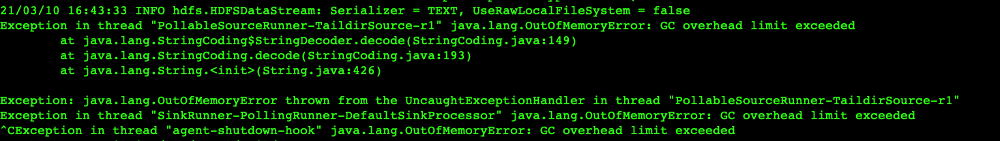
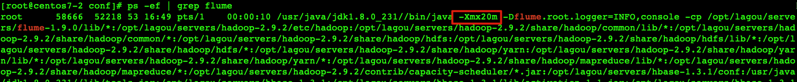
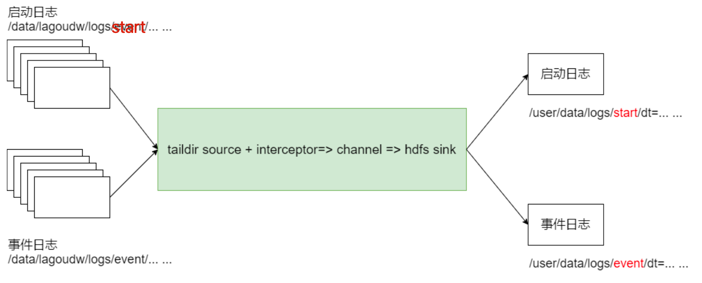
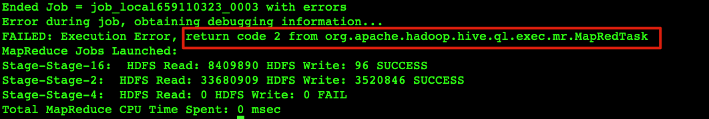
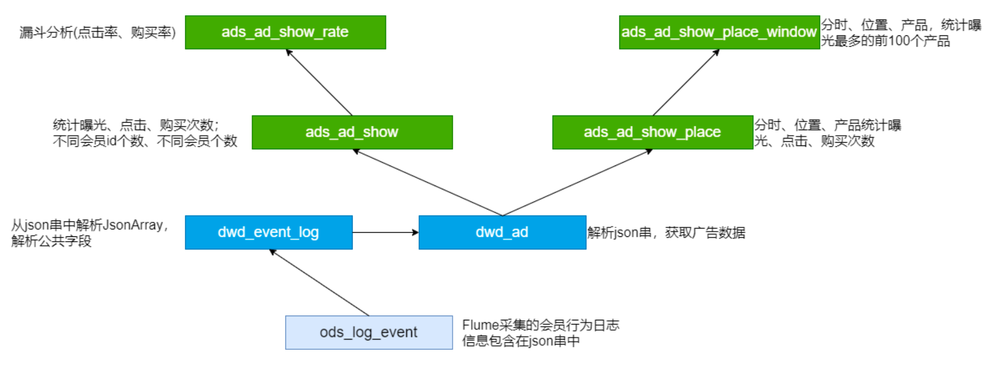
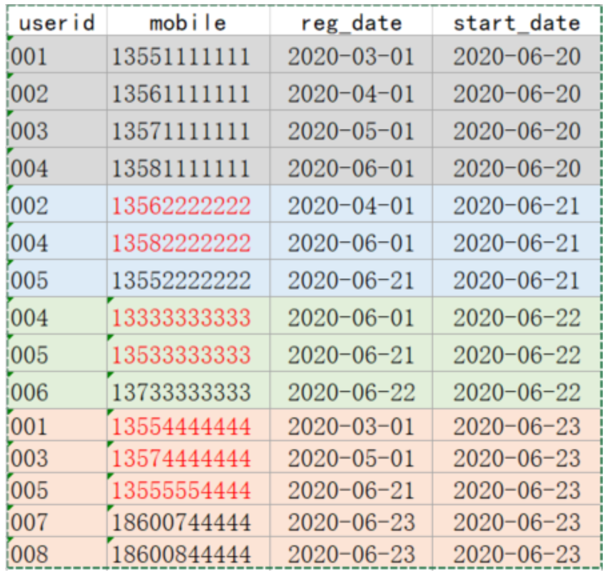

- [json数据处理](#json数据处理)
  - [**使用内建函数处理**](#使用内建函数处理)
    - [自定义UDF函数](#自定义udf函数)
  - [使用SerDe处理](#使用serde处理)
  - [**DWD****层建表和数据加载**](#dwd层建表和数据加载)
    - [**5.1****、创建****DWD****层表**](#51创建dwd层表)
  - [**活跃会员**](#活跃会员)
    - [**创建****ADS****层表**](#创建ads层表)
  - [**新增会员**](#新增会员)
  - [**留存会员**](#留存会员)
  - [**创建****ADS****层表**](#创建ads层表-1)
  - [**第四部分 电商分析之****--****广告业务**](#第四部分-电商分析之--广告业务)
    - [事件日志采集](#事件日志采集)
    - [**ODS****层建表和数据加载**](#ods层建表和数据加载)
    - [**DWD****层建表和数据加载**](#dwd层建表和数据加载-1)
      - [**DWD****层建表**](#dwd层建表)
      - [**DWD****层数据加载**](#dwd层数据加载)
    - [**广告点击次数分析**](#广告点击次数分析)
      - [**创建****ADS****层表**](#创建ads层表-2)
    - [**漏斗分析****(****点击率购买率****)**](#漏斗分析点击率购买率)
    - [**广告效果分析**](#广告效果分析)
    - [**广告分析小结**](#广告分析小结)
      - [**ADS****层数据导出(****DataX****)**](#ads层数据导出datax)
    - [**高仿日志数据测试**](#高仿日志数据测试)

### Agent的配置
/data/lagoudw/conf/flume-log2hdfs1.conf
```sh
a1.sources = r1
a1.sinks = k1
a1.channels = c1

# taildir source
a1.sources.r1.type = TAILDIR
a1.sources.r1.positionFile =/data/lagoudw/conf/startlog_position.json
a1.sources.r1.filegroups = f1
a1.sources.r1.filegroups.f1 = /data/lagoudw/logs/middle/start/.*log

# memorychannel
a1.channels.c1.type = memory
a1.channels.c1.capacity = 100000
a1.channels.c1.transactionCapacity = 2000

# hdfs sink
a1.sinks.k1.type = hdfs
a1.sinks.k1.hdfs.path = /user/data/logs/start/%Y-%m-%d/
a1.sinks.k1.hdfs.filePrefix = startlog.
# DataStream will not compress output file and please don’t set codeC
a1.sinks.k1.hdfs.fileType = DataStream

# 配置文件滚动方式(文件大小20M)
a1.sinks.k1.hdfs.rollSize = 20971520
a1.sinks.k1.hdfs.rollCount = 0
a1.sinks.k1.hdfs.rollInterval = 0
a1.sinks.k1.hdfs.idleTimeout = 0
a1.sinks.k1.hdfs.minBlockReplicas = 1

# 向hdfs上刷新的event的个数
a1.sinks.k1.hdfs.batchSize = 1000

# 使用本地时间
a1.sinks.k1.hdfs.useLocalTimeStamp = true

# Bind the source and sink to the channel
a1.sources.r1.channels = c1
a1.sinks.k1.channel = c1
```

开始采集

```sh
flume-ng agent --conf-file /data/lagoudw/conf/flume-log2hdfs1.conf\
-name a1 -Dflume.root.logger=INFO,console
```





一运行就GC了，因为默认配置只给JVM分配了20M，需要改默认值

```sh
vim $FLUME_HOME/conf/flume-env.sh 

# 最大最小都改成1000M，减少内存抖动带来的性能影响
export JAVA_OPTS="-Xms1000m -Xmx1000m -Dcom.sun.management.jmxremote"
```

启动的时候带上系统配置参数--conf

```sh
flume-ng agent --conf /opt/lagou/servers/flume-1.9.0/conf/ \
--conf-file /data/lagoudw/conf/flume-log2hdfs1.conf -name a1 \
-Dflume.root.logger=INFO,console
```


/data/lagoudw/conf/flumetest1.conf

```sh
# a1是agent的名称。source、channel、sink的名称分别为:r1 c1 k1 
a1.sources = r1
a1.channels = c1
a1.sinks = k1
# source
a1.sources.r1.type = netcat
a1.sources.r1.bind = centos7-2
a1.sources.r1.port = 9999
a1.sources.r1.interceptors = i1
a1.sources.r1.interceptors.i1.type = com.lagou.dw.flume.interceptor.CustomInterceptor$Builder

# channel
a1.channels.c1.type = memory
a1.channels.c1.capacity = 10000
a1.channels.c1.transactionCapacity = 100

# sink
a1.sinks.k1.type = logger

# source、channel、sink之间的关系
a1.sources.r1.channels = c1
a1.sinks.k1.channel = c1
```

把自定义的包放在flume/lib下面，或者建立软链接

```sh
ln -s /data/lagoudw/jars/FlumeTimestampInterceptor.jar /opt/lagou/servers/flume-1.9.0/lib/FlumeTimestampInterceptor.jar
```

```sh
flume-ng agent --conf /opt/lagou/servers/flume-1.9.0/conf/ \
--conf-file /data/lagoudw/conf/flumetest1.conf -name a1 \
-Dflume.root.logger=INFO,console
```

把拦截器用在数据采集上

/data/lagoudw/conf/flume-log2hdfs2.conf

```sh
a1.sources = r1
a1.sinks = k1
a1.channels = c1

# taildir source
a1.sources.r1.type = TAILDIR
a1.sources.r1.positionFile =/data/lagoudw/conf/startlog_position.json
a1.sources.r1.filegroups = f1
a1.sources.r1.filegroups.f1 = /data/lagoudw/logs/middle/start/.*log
a1.sources.r1.interceptors = i1
a1.sources.r1.interceptors.i1.type = com.lagou.dw.flume.interceptor.CustomInterceptor$Builder

# memorychannel
a1.channels.c1.type = memory
a1.channels.c1.capacity = 100000
a1.channels.c1.transactionCapacity = 2000

# hdfs sink
a1.sinks.k1.type = hdfs
# 取headers的字段
a1.sinks.k1.hdfs.path = /user/data/logs/start/dt=%{logtime}
a1.sinks.k1.hdfs.filePrefix = startlog.
# DataStream will not compress output file and please don’t set codeC
a1.sinks.k1.hdfs.fileType = DataStream

# 配置文件滚动方式(文件大小20M)
a1.sinks.k1.hdfs.rollSize = 20971520
a1.sinks.k1.hdfs.rollCount = 0
a1.sinks.k1.hdfs.rollInterval = 0
a1.sinks.k1.hdfs.idleTimeout = 0
a1.sinks.k1.hdfs.minBlockReplicas = 1

# 向hdfs上刷新的event的个数
a1.sinks.k1.hdfs.batchSize = 1000

# 使用本地时间
# a1.sinks.k1.hdfs.useLocalTimeStamp = true

# Bind the source and sink to the channel
a1.sources.r1.channels = c1
a1.sinks.k1.channel = c1
```

再次采集启动日志

```sh
flume-ng agent --conf /opt/lagou/servers/flume-1.9.0/conf/ \
--conf-file /data/lagoudw/conf/flume-log2hdfs2.conf -name a1 \
-Dflume.root.logger=INFO,console
```


#### 采集启动日志和事件日志

本系统中要采集两种日志:启动日志、事件日志，不同的日志放置在不同的目录下。
要想一次拿到全部日志需要监控多个目录。



**总体思路**

1、taildir监控多个目录 

2、修改自定义拦截器，不同来源的数据加上不同标志 

3、hdfs sink 根据标志写文件

##### Agent配置

/data/lagoudw/conf/flume-log2hdfs3.conf

```sh
a1.sources = r1
a1.sinks = k1
a1.channels = c1

# taildir source
a1.sources.r1.type = TAILDIR
a1.sources.r1.positionFile =/data/lagoudw/conf/startlog_position.json
a1.sources.r1.filegroups = f1 f2
a1.sources.r1.filegroups.f1 = /data/lagoudw/logs/middle/start/.*log
a1.sources.r1.headers.f1.logtype = start
a1.sources.r1.filegroups.f2 = /data/lagoudw/logs/middle/event/.*log
a1.sources.r1.headers.f2.logtype = event
a1.sources.r1.interceptors = i1
a1.sources.r1.interceptors.i1.type = com.lagou.dw.flume.interceptor.LogTypeInterceptor$Builder

# memorychannel
a1.channels.c1.type = memory
a1.channels.c1.capacity = 100000
a1.channels.c1.transactionCapacity = 2000

# hdfs sink
a1.sinks.k1.type = hdfs
# %{xxx} 取headers对应字段的值
a1.sinks.k1.hdfs.path = /user/data/logs/%{logtype}/dt=%{logtime}
a1.sinks.k1.hdfs.filePrefix = %{logtype}log
# DataStream will not compress output file and please don’t set codeC
a1.sinks.k1.hdfs.fileType = DataStream

# 配置文件滚动方式(文件大小20M)
a1.sinks.k1.hdfs.rollSize = 20971520
a1.sinks.k1.hdfs.rollCount = 0
a1.sinks.k1.hdfs.rollInterval = 0
a1.sinks.k1.hdfs.idleTimeout = 0
a1.sinks.k1.hdfs.minBlockReplicas = 1

# 向hdfs上刷新的event的个数
a1.sinks.k1.hdfs.batchSize = 1000

# Bind the source and sink to the channel
a1.sources.r1.channels = c1
a1.sinks.k1.channel = c1
```

上传自定义拦截器到$FLUME_HOME/lib

再次采集启动日志

```sh
flume-ng agent --conf /opt/lagou/servers/flume-1.9.0/conf/ \
--conf-file /data/lagoudw/conf/flume-log2hdfs3.conf -name a1 \
-Dflume.root.logger=INFO,console
```

生产环境使用下面的指令启动

```sh
nohup flume-ng agent --conf /opt/lagou/servers/flume-1.9.0/conf/ \
--conf-file /data/lagoudw/conf/flume-log2hdfs3.conf -name a1 \
-Dflume.root.logger=INFO,LOGFILE > /dev/null 2>&1 &

# /dev/null，代表linux的空设备文件，所有往这个文件里面写入的内容都会丢失，俗称黑洞
# 2>&1 错误输出将会和标准输出输出到同一个地方
# >/dev/null 2>&1 不会输出任何信息到控制台，也不会有任何信息输出到文件中
```

### ODS建表和数据加载

建表

```sql
use ods;
create external table ods.ods_start_log(
`str` string)
comment '用户启动日志信息'
partitioned by (`dt` string)
location '/user/data/logs/start';
-- 直接把目录设置为采集数据存的目录

-- 测试加载分区
show partitions ods_start_log;
alter table ods.ods_start_log add partition(dt='2020-07-21');
select * from ods.ods_start_log limit 10;
alter table ods.ods_start_log drop partition(dt='2020-07-21');
```

使用脚本新增分区，后面会使用任务调度工具，定时执行

script/member_active/ods_load_log.sh

可以传参数确定日志，如果没有传参使用昨天日期

```sh
#! /bin/bash
APP=ODS
hive=/opt/lagou/servers/hive-2.3.7/bin/hive

# 
# if [ -n "$1" ]
if [ $# == 1 ]
then 
	do_date=$1
else
	do_date=`date -d "-1 day" +%F`
fi

sql="
alter table $APP.ods_start_log add partition(dt='$do_date');
"

$hive -e "$sql"

```

## json数据处理

### **使用内建函数处理**

**get_json_object(string json_string, string path)**

**json_tuple(jsonStr, k1, k2, ...)**

用到的测试数据weibo.json

```txt
user1;18;male;{"id": 1,"ids": [101,102,103],"total_number": 3}
user2;20;female;{"id": 2,"ids": [201,202,203,204],"total_number": 4}
user3;23;male;{"id": 3,"ids": [301,302,303,304,305],"total_number": 5}
user4;17;male;{"id": 4,"ids": [401,402,403,304],"total_number": 5}
user5;35;female;{"id": 5,"ids": [501,502,503],"total_number": 3}
```

```sql
-- 数据格式
-- user4;17;male;{"id": 4,"ids": [401,402,403,304],"total_number": 5}

-- 内建函数处理json数据
CREATE TABLE IF NOT EXISTS jsont1(
username string,
age int,
sex string,
json string
)
row format delimited fields terminated by ';';

load data local inpath '/data/lagoudw/data/weibo.json' overwrite into table jsont1;

select * from jsont1;

-- get single
select username, age, sex, GET_JSON_OBJECT(json, "$.id") id,
GET_JSON_OBJECT(json, "$.ids") ids,
GET_JSON_OBJECT(json, "$.total_number") total_number
from jsont1;

-- get array element
select username, age, sex, GET_JSON_OBJECT(json, "$.id") id,
GET_JSON_OBJECT(json, "$.ids[0]") id1,
GET_JSON_OBJECT(json, "$.ids[1]") id2,
GET_JSON_OBJECT(json, "$.ids[2]") id3,
GET_JSON_OBJECT(json, "$.ids[3]") id4,
GET_JSON_OBJECT(json, "$.total_number") total_number
from jsont1;

-- get with json_tuple
select json_tuple(json, 'id', 'ids', 'total_number') from jsont1;

--  UDTF's are not supported outside the SELECT clause, nor nested in expressions
select username, age, sex, json_tuple(json, 'id', 'ids', 'total_number') from jsont1;

-- 需要使用lateral view
select REGEXP_REPLACE("[101,102,103]", "\\[|\\]","");

select split(REGEXP_REPLACE("[101,102,103]", "\\[|\\]",""), ",");
select explode(split(REGEXP_REPLACE("[101,102,103]", "\\[|\\]",""), ","));

select username, age, sex, id, ids, num
from jsont1
lateral view json_tuple(json, 'id', 'ids', 'total_number') t1 
as id, ids, num;

with tmp as(
select username, age, sex, id, ids, num
from jsont1
lateral view json_tuple(json, 'id', 'ids', 'total_number') t1 
as id, ids, num
)
select username, age, sex, id, ids1, num
from tmp 
lateral view explode(split(REGEXP_REPLACE(ids, "\\[|\\]",""), ",")) t1 as ids1;

-- json_tuple 优点是一次可以解析多个json字段，对嵌套结果的解析操作复杂;
```

#### 自定义UDF函数

```java
java 代码
```


```sql
-- 使用自定义 UDF 函数
-- 添加开发的jar包
add jar /data/lagoudw/jars/HiveUDF.jar;
-- 加载临时函数
create temporary function lagou_json_array as "com.lagou.dw.hive.udf.ParseJsonArray";

-- 执行查询
select username, age, sex, lagou_json_array(json, 'ids') ids from jsont1;

-- 解析json串中的数组，并展开
select username, age, sex, ids1
from jsont1
lateral view explode(lagou_json_array(json, 'ids')) t1 as ids1;

-- 解析json串中的id、num
select username, age, sex, id, num
from jsont1
lateral view json_tuple(json, 'id', 'total_number') t1 as id, num;

-- 解析json串中的数组，并展开
select username, age, sex, id, num, ids1
from jsont1
lateral view json_tuple(json, 'id', 'total_number') t1 as id, num
lateral view explode(lagou_json_array(json, 'ids')) t1 as ids1;
```

### 使用SerDe处理

```json
{"id": 1,"ids": [101,102,103],"total_number": 3}
{"id": 2,"ids": [201,202,203,204],"total_number": 4}
{"id": 3,"ids": [301,302,303,304,305],"total_number": 5}
{"id": 4,"ids": [401,402,403,304],"total_number": 5}
{"id": 5,"ids": [501,502,503],"total_number": 3}
```

```sql
create table jsont2(
  id int,
	ids array<string>, 
  total_number int)
ROW FORMAT SERDE 'org.apache.hive.hcatalog.data.JsonSerDe';
load data local inpath '/data/lagoudw/data/json2.dat' into table jsont2;
```

###  **DWD****层建表和数据加载**

#### **5.1****、创建****DWD****层表**

```sql
use DWD;
drop table if exists dwd.dwd_start_log;
CREATE TABLE dwd.dwd_start_log(
`device_id` string,
`area` string,
`uid` string,
`app_v` string,
`event_type` string,
`os_type` string,
`channel` string,
`language` string,
`brand` string,
`entry` string,
`action` string,
`error_code` string
 )
PARTITIONED BY (dt string)
STORED AS parquet;
```

script/member_active/dwd_load_start.sh

```sh
#! /bin/bash

hive=/opt/lagou/servers/hive-2.3.7/bin/hive

# 
# if [ -n "$1" ]
if [ $# == 1 ]
then 
	do_date=$1
else
	do_date=`date -d "-1 day" +%F`
fi

sql="
with tmp as (
SELECT split(str, ' ')[7] as line 
from ods.ods_start_log
where dt='$do_date'
)
insert overwrite table dwd.dwd_start_log partition(dt='$do_date')
select 
GET_JSON_OBJECT(line, '$.attr.device_id') device_id,
GET_JSON_OBJECT(line, '$.attr.area') area,
GET_JSON_OBJECT(line, '$.attr.uid') uid,
GET_JSON_OBJECT(line, '$.attr.app_v') app_v,
GET_JSON_OBJECT(line, '$.attr.event_type') event_type,
GET_JSON_OBJECT(line, '$.attr.os_type') os_type,
GET_JSON_OBJECT(line, '$.attr.channel') channel,
GET_JSON_OBJECT(line, '$.attr.language') language,
GET_JSON_OBJECT(line, '$.attr.brand') brand,
GET_JSON_OBJECT(line, '$.app_active.json.entry') entry,
GET_JSON_OBJECT(line, '$.app_active.json.action') action,
GET_JSON_OBJECT(line, '$.app_active.json.error_code') error_code
from tmp;
"

$hive -e "$sql"
```


### **活跃会员**

```sql
use DWS;
drop table if exists dws.dws_member_start_day;
CREATE TABLE dws.dws_member_start_day(
`device_id` string,
`area` string,
`uid` string,
`app_v` string,
`event_type` string,
`os_type` string,
`channel` string,
`language` string,
`brand` string,
`entry` string
 ) COMMENT '会员日启动汇总'
PARTITIONED BY (dt string)
STORED AS parquet;

drop table if exists dws.dws_member_start_week;
CREATE TABLE dws.dws_member_start_week(
`device_id` string,
`area` string,
`uid` string,
`app_v` string,
`event_type` string,
`os_type` string,
`channel` string,
`language` string,
`brand` string,
`entry` string,
`week` string
 ) COMMENT '会员周启动汇总'
PARTITIONED BY (dt string)
STORED AS parquet;

drop table if exists dws.dws_member_start_month;
CREATE TABLE dws.dws_member_start_month(
`device_id` string,
`area` string,
`uid` string,
`app_v` string,
`event_type` string,
`os_type` string,
`channel` string,
`language` string,
`brand` string,
`entry` string,
`month` string
 ) COMMENT '会员月启动汇总'
PARTITIONED BY (dt string)
STORED AS parquet;
```

script/member_active/dws_load_member_start.sh

```sh
#! /bin/bash
hive=/opt/lagou/servers/hive-2.3.7/bin/hive

if [ -n "$1" ]
then 
	do_date=$1
else
	do_date=`date -d "-1 day" +%F`
fi

# 汇总得到每日活跃会员信息;每日数据汇总得到每周、每月数据
sql="
insert overwrite table dws.dws_member_start_day partition(dt='$do_date')
select 
device_id,
concat_ws('|', collect_set(area)),
concat_ws('|', collect_set(uid)),
concat_ws('|', collect_set(app_v)),
concat_ws('|', collect_set(event_type)),
concat_ws('|', collect_set(os_type)),
concat_ws('|', collect_set(channel)),
concat_ws('|', collect_set(language)),
concat_ws('|', collect_set(brand)),
concat_ws('|', collect_set(entry))
from dwd.dwd_start_log 
where dt='$do_date'
group by device_id;

-- 汇总得到每周活跃会员
insert overwrite table dws.dws_member_start_week partition(dt='$do_date')
select 
device_id,
concat_ws('|', collect_set(area)),
concat_ws('|', collect_set(uid)),
concat_ws('|', collect_set(app_v)),
concat_ws('|', collect_set(event_type)),
concat_ws('|', collect_set(os_type)),
concat_ws('|', collect_set(channel)),
concat_ws('|', collect_set(language)),
concat_ws('|', collect_set(brand)),
concat_ws('|', collect_set(entry)),
DATE_ADD(NEXT_DAY('$do_date', 'mo'), -7)
from dws.dws_member_start_day 
where dt >= DATE_ADD(NEXT_DAY('$do_date', 'mo'), -7) 
and dt <= '$do_date'
group by device_id;

-- 汇总得到每月活跃会员
insert overwrite table dws.dws_member_start_month partition(dt='$do_date')
select 
device_id,
concat_ws('|', collect_set(area)),
concat_ws('|', collect_set(uid)),
concat_ws('|', collect_set(app_v)),
concat_ws('|', collect_set(event_type)),
concat_ws('|', collect_set(os_type)),
concat_ws('|', collect_set(channel)),
concat_ws('|', collect_set(language)),
concat_ws('|', collect_set(brand)),
concat_ws('|', collect_set(entry)),
DATE_FORMAT('$do_date', 'yyyy-MM')
from dws.dws_member_start_day 
where dt >= DATE_FORMAT('$do_date', 'yyyy-MM-01')
and dt <= '$do_date'
group by device_id;
"

$hive -e "$sql"
```

#### **创建****ADS****层表**

计算当天、当周、当月活跃会员数量

```sql
drop table if exists ads.ads_member_active_count; 
create table ads.ads_member_active_count( 
  `day_count` int COMMENT '当日会员数量', 
  `week_count` int COMMENT '当周会员数量', 
  `month_count` int COMMENT '当月会员数量'
) COMMENT '活跃会员数'
partitioned by(dt string)
row format delimited fields terminated by ',';
```

**加载****ADS****层数据**

script/member_active/ads_load_member_active.sh

```sh
#! /bin/bash

hive=/opt/lagou/servers/hive-2.3.7/bin/hive

# 
# if [ -n "$1" ]
if [ $# == 1 ]
then 
	do_date=$1
else
	do_date=`date -d "-1 day" +%F`
fi

sql="
with tmp as (
select 'day' datelabel, count(*) cnt, dt
	from dws.dws_member_start_day
	where dt='$do_date'
group by dt
union all
select 'week' datelabel, count(*) cnt, dt
	from dws.dws_member_start_week
	where dt='$do_date'
	group by dt
union all
select 'month' datelabel, count(*) cnt, dt
	from dws.dws_member_start_month
	where dt='$do_date'
	group by dt
)
insert overwrite table ads.ads_member_active_count partition(dt='$do_date')
select sum(case when datelabel='day' then cnt end) as day_count,
			sum(case when datelabel='week' then cnt end) as week_count,
			sum(case when datelabel='month' then cnt end) as month_count
from tmp 
group by dt;
"

$hive -e "$sql"
```

script/member_active/ads_load_member_active2.sh

```sh
#! /bin/bash

hive=/opt/lagou/servers/hive-2.3.7/bin/hive

# 
# if [ -n "$1" ]
if [ $# == 1 ]
then 
	do_date=$1
else
	do_date=`date -d "-1 day" +%F`
fi

sql="
insert overwrite table ads.ads_member_active_count partition(dt='$do_date')
select daycnt, weekcnt, monthcnt
from (select dt, count(*) daycnt 
			from dws.dws_member_start_day 
			where dt='$do_date' 
			group by dt) day join
			(select dt, count(*) weekcnt 
			from dws.dws_member_start_week 
			where dt='$do_date' 
			group by dt) week on day.dt=week.dt
			join
			(select dt, count(*) monthcnt 
			from dws.dws_member_start_month 
			where dt='$do_date' 
			group by dt) month on week.dt=month.dt;
"

$hive -e "$sql"
```

### **新增会员**

创建DWS层表

```sh
drop table if exists dws.dws_member_add_day;
create table dws.dws_member_add_day
(
`device_id` string,
`uid` string,
`app_v` string,
`os_type` string,
`language` string,
`channel` string,
`area` string,
`brand` string
) COMMENT '每日新增会员明细' 
partitioned by(dt string)
stored as parquet;
```

script/member_active/dws_load_member_add_day.sh

```sh
#! /bin/bash

hive=/opt/lagou/servers/hive-2.3.7/bin/hive

# 
# if [ -n "$1" ]
if [ $# == 1 ]
then 
	do_date=$1
else
	do_date=`date -d "-1 day" +%F`
fi

sql="
insert into table dws.dws_member_add_day
partition(dt='$do_date')
select 
t1.device_id,
t1.uid,
t1.app_v,
t1.os_type,
t1.language,
t1.channel,
t1.area,
t1.brand
  from dws.dws_member_start_day t1
  left join dws.dws_member_add_day t2 
  on t1.device_id=t2.device_id
 where t1.dt='$do_date'
   and t2.device_id is null;
"

$hive -e "$sql"
```

**创建****ADS****层表**

```sql
drop table if exists ads.ads_new_member_cnt;
create table ads.ads_new_member_cnt
(
`cnt` string
)
partitioned by(dt string)
row format delimited fields terminated by ',';
```

script/member_active/ads_load_member_add.sh

```sh
#! /bin/bash

hive=/opt/lagou/servers/hive-2.3.7/bin/hive

# 
# if [ -n "$1" ]
if [ $# == 1 ]
then 
	do_date=$1
else
	do_date=`date -d "-1 day" +%F`
fi

sql="
insert into table ads.ads_new_member_cnt
partition(dt='$do_date')
select count(*) 
from dws.dws_member_add_day
where dt='$do_date'
"
echo "$sql"
$hive -e "$sql"
```

### **留存会员**

**创建****DWS****层表**

```sql
-- 会员留存明细
drop table if exists dws.dws_member_retention_day;
create table dws.dws_member_retention_day
(
`device_id` string,
`uid` string,
`app_v` string,
`os_type` string,
`language` string,
`channel` string,
`area` string,
`brand` string,
`add_date` string comment '会员新增时间',
 `retention_date` int comment '留存天数'
)COMMENT '每日会员留存明细'
PARTITIONED BY (`dt` string)
stored as parquet;
```

**加载****DWS****层数据**

script/member_active/dws_load_member_retention_day.sh

```sh
#! /bin/bash

hive=/opt/lagou/servers/hive-2.3.7/bin/hive

# 
# if [ -n "$1" ]
if [ $# == 1 ]
then 
	do_date=$1
else
	do_date=`date -d "-1 day" +%F`
fi

sql="
set hive.exec.mode.local.auto=false;

drop table if exists tmp.tmp_member_retention;
create table tmp.tmp_member_retention as
(
select 
t1.device_id,
t1.uid,
t1.app_v,
t1.os_type,
t1.language,
t1.channel,
t1.area,
t1.brand,
t1.dt,
1
from dws.dws_member_add_day t1 
join dws.dws_member_start_day t2
on t1.device_id=t2.device_id
where t1.dt=date_add('$do_date',-1)
and t2.dt='$do_date'

union all 

select 
t1.device_id,
t1.uid,
t1.app_v,
t1.os_type,
t1.language,
t1.channel,
t1.area,
t1.brand,
t1.dt,
2
from dws.dws_member_add_day t1 
join dws.dws_member_start_day t2
on t1.device_id=t2.device_id
where t1.dt=date_add('$do_date',-2)
and t2.dt='$do_date'

union all

select 
t1.device_id,
t1.uid,
t1.app_v,
t1.os_type,
t1.language,
t1.channel,
t1.area,
t1.brand,
t1.dt,
3
from dws.dws_member_add_day t1 
join dws.dws_member_start_day t2
on t1.device_id=t2.device_id
where t1.dt=date_add('$do_date',-3)
and t2.dt='$do_date'
);

insert overwrite table dws.dws_member_retention_day
partition(dt='$do_date')
select * from tmp.tmp_member_retention;
"
echo "$sql"
$hive -e "$sql"
```



一般是内部错误

1、找日志(hive.log【简略】 / MR的日志【详细】)
 hive.log ===> 缺省情况下 /tmp/root/hive.log (hive-site.conf) 

MR的日志 ===> 启动historyserver、日志聚合 + SQL运行在集群模式

需要确认local模式是否关闭，只有集群模式才能看到日志

```sh
vim $HIVE_HOME/conf/hive-site.xml 

hive.exec.mode.local.auto

# 在hive客户端查看
set hive.exec.mode.local.auto;
```

### **创建****ADS****层表**

```sql
-- 会员留存数
drop table if exists ads.ads_member_retention_count; 
create table ads.ads_member_retention_count
(
	`add_date` string comment '新增日期', 
 	`retention_day` int comment '截止当前日期留存天数',
  `retention_count` bigint comment '留存数'
) COMMENT '会员留存数'
partitioned by(dt string)
row format delimited fields terminated by ',';

-- 会员留存率
drop table if exists ads.ads_member_retention_rate; 
create table ads.ads_member_retention_rate
(
	`add_date` string comment '新增日期',
	`retention_day` int comment '截止当前日期留存天数', 
	`retention_count` bigint comment '留存数',
	`new_mid_count` 	bigint comment '当日会员新增数', 
	`retention_ratio`  decimal(10,2) comment '留存率'
) COMMENT '会员留存率'
partitioned by(dt string)
row format delimited fields terminated by ',';
```

script/member_active/ads_load_member_retention.sh

```sh
#! /bin/bash

hive=/opt/lagou/servers/hive-2.3.7/bin/hive

# 
# if [ -n "$1" ]
if [ $# == 1 ]
then 
	do_date=$1
else
	do_date=`date -d "-1 day" +%F`
fi

sql="
insert overwrite table ads.ads_member_retention_count
partition(dt='$do_date')
select 
add_date,
retention_date retention_day,
count(*)  retention_count
from dws.dws_member_retention_day
where dt='$do_date'
group by add_date, retention_date;

insert overwrite table ads.ads_member_retention_rate
partition(dt='$do_date')
select 
t1.add_date,
t1.retention_day,
t1.retention_count,
t2.cnt,
t1.retention_count/t2.cnt*100
from ads.ads_member_retention_count t1 join
ads.ads_new_member_cnt t2 on t1.add_date=t2.dt
where t1.dt='$do_date';
"
echo "$sql"
$hive -e "$sql"
```

DataX

Mytest.job

```json
{
    "job": {
        "setting": {
            "speed": {
              	"channel":1,
                "byte":10485760
            },
            "errorLimit": {
                "record": 0,
                "percentage": 0.02
            }
        },
        "content": [
            {
                "reader": {
                    "name": "streamreader",
                    "parameter": {
                        "sliceRecordCount": 10,
                        "column" : [
                            {
                                "value": "DataX",
                                "type": "string"
                            },
                          	{
                                "value": "数据迁移工具",
                                "type": "string"
                            },
                            {
                                "value": 19890604,
                                "type": "long"
                            },
                            {
                                "value": "1989-06-04 00:00:00",
                                "type": "date"
                            },
                            {
                                "value": true,
                                "type": "bool"
                            },
                            {
                                "value": "test",
                                "type": "bytes"
                            }
                        ],
                    }
                },
                "writer": {
                    "name": "streamwriter",
                    "parameter": {
                        "print": true,
                        "encoding": "UTF-8"
                    }
                }
            }
        ]
    }
}
```

HDFS => mysql

export_member_active_count.json


```json
{
    "job": {
        "setting": {
            "speed": {
                "channel": 1
            }
        },
        "content": [
            {
                "reader": {
                    "name": "hdfsreader",
                    "parameter": {
                        "path": "/user/hive/warehouse/ads.db/ads_member_active_count/dt=$do_date/*",
                        "defaultFS": "hdfs://centos7-1:9000",
                        "column": [
                               {
                                "value": "$do_date",
                                "type": "string"
                               },
                               {
                                "index": 0,
                                "type": "long"
                               },
                               {
                                "index": 1,
                                "type": "long"
                               },
                               {
                                "index": 2,
                                "type": "long"
                               }
                        ],
                        "fileType": "text",
                        "encoding": "UTF-8",
                        "fieldDelimiter": ","
                    }

                },
                "writer": {
                    "name": "mysqlwriter",
                    "parameter": {
                        "writeMode": "replace",
                        "username": "hive",
                        "password": "12345678",
                        "column": [
                            "dt",
                            "day_count",
                            "week_count",
                            "month_count"
                        ],
                        "connection": [
                            {
                                "jdbcUrl": "jdbc:mysql://centos7-3:3306/dwads?useUnicode=true&characterEncoding=utf-8",
                                "table": [
                                    "ads_member_active_count"
                                ]
                            }
                        ]
                    }
                }
            }
        ]
    }
}
```

执行命令：-p 使用参数， -D动态参数，do_date=2020-08-02 实际传递的参数

```sh
python datax.py -p "-Ddo_date=2020-07-22" /data/lagoudw/script/member_active/t1.json
```

export_member_active_count.sh

```sh
#!/bin/bash
JSON=/data/lagoudw/script/member_active
source /etc/profile

if [ -n "$1" ] ;then
    do_date=$1
else
    do_date=`date -d "-1 day" +%F`
fi

datax.py -p "-Ddo_date=$do_date" /data/lagoudw/script/member_active/export_member_active_count.json
```

export_member_retention_count.json

```json
{
    "job": {
        "setting": {
            "speed": {
                "channel": 1
            }
        },
        "content": [
            {
                "reader": {
                    "name": "hdfsreader",
                    "parameter": {
                        "path": "/user/hive/warehouse/ads.db/ads_member_retention_count/dt=$do_date/*",
                        "defaultFS": "hdfs://centos7-1:9000",
                        "column": [
                               {
                                "value": "$do_date",
                                "type": "string"
                               },
                               {
                                "index": 0,
                                "type": "string"
                               },
                               {
                                "index": 1,
                                "type": "long"
                               },
                               {
                                "index": 2,
                                "type": "long"
                               }
                        ],
                        "fileType": "text",
                        "encoding": "UTF-8",
                        "fieldDelimiter": ","
                    }

                },
                "writer": {
                    "name": "mysqlwriter",
                    "parameter": {
                        "writeMode": "replace",
                        "username": "hive",
                        "password": "12345678",
                        "column": ["*"],
                        "connection": [
                            {
                                "jdbcUrl": "jdbc:mysql://centos7-3:3306/dwads?useUnicode=true&characterEncoding=utf-8",
                                "table": [
                                    "ads_member_retention_count"
                                ]
                            }
                        ]
                    }
                }
            }
        ]
    }
}
```

export_member_retention_count.sh

```sh
#!/bin/bash
JSON=/data/lagoudw/script/member_active
source /etc/profile

if [ -n "$1" ] ;then
    do_date=$1
else
    do_date=`date -d "-1 day" +%F`
fi

datax.py -p "-Ddo_date=$do_date" /data/lagoudw/script/member_active/export_member_retention_count.json
```

export_member_retention_rate.json

```json
{
    "job": {
        "setting": {
            "speed": {
                "channel": 1
            }
        },
        "content": [
            {
                "reader": {
                    "name": "hdfsreader",
                    "parameter": {
                        "path": "/user/hive/warehouse/ads.db/ads_member_retention_rate/dt=$do_date/*",
                        "defaultFS": "hdfs://centos7-1:9000",
                        "column": [
                               {
                                "value": "$do_date",
                                "type": "string"
                               },
                               {
                                "index": 0,
                                "type": "string"
                               },
                               {
                                "index": 1,
                                "type": "long"
                               },
                               {
                                "index": 2,
                                "type": "long"
                               },
                          		{
                                "index": 3,
                                "type": "long"
                               },
		                           {
                                "index": 4,
                                "type": "double"
                               }
                        ],
                        "fileType": "text",
                        "encoding": "UTF-8",
                        "fieldDelimiter": ","
                    }

                },
                "writer": {
                    "name": "mysqlwriter",
                    "parameter": {
                        "writeMode": "replace",
                        "username": "hive",
                        "password": "12345678",
                        "column": ["*"],
                        "connection": [
                            {
                                "jdbcUrl": "jdbc:mysql://centos7-3:3306/dwads?useUnicode=true&characterEncoding=utf-8",
                                "table": [
                                    "ads_member_retention_rate"
                                ]
                            }
                        ]
                    }
                }
            }
        ]
    }
}
```

export_member_retention_rate.sh

```sh
#!/bin/bash
JSON=/data/lagoudw/script/member_active
source /etc/profile

if [ -n "$1" ] ;then
    do_date=$1
else
    do_date=`date -d "-1 day" +%F`
fi

datax.py -p "-Ddo_date=$do_date" /data/lagoudw/script/member_active/export_member_retention_rate.json
```

export_new_member_cnt.json

```json
{
    "job": {
        "setting": {
            "speed": {
                "channel": 1
            }
        },
        "content": [
            {
                "reader": {
                    "name": "hdfsreader",
                    "parameter": {
                        "path": "/user/hive/warehouse/ads.db/ads_new_member_cnt/dt=$do_date/*",
                        "defaultFS": "hdfs://centos7-1:9000",
                        "column": [
                               {
                                "value": "$do_date",
                                "type": "string"
                               },
                               {
                                "index": 0,
                                "type": "long"
                               }
                        ],
                        "fileType": "text",
                        "encoding": "UTF-8",
                        "fieldDelimiter": ","
                    }

                },
                "writer": {
                    "name": "mysqlwriter",
                    "parameter": {
                        "writeMode": "replace",
                        "username": "hive",
                        "password": "12345678",
                        "column": ["*"],
                        "connection": [
                            {
                                "jdbcUrl": "jdbc:mysql://centos7-3:3306/dwads?useUnicode=true&characterEncoding=utf-8",
                                "table": [
                                    "ads_new_member_cnt"
                                ]
                            }
                        ]
                    }
                }
            }
        ]
    }
}
```

export_new_member_cnt.sh

```sh
#!/bin/bash
JSON=/data/lagoudw/script/member_active
source /etc/profile

if [ -n "$1" ] ;then
    do_date=$1
else
    do_date=`date -d "-1 day" +%F`
fi

datax.py -p "-Ddo_date=$do_date" /data/lagoudw/script/member_active/export_new_member_cnt.json
```

大数据量处理

```sh
# 清理工作
rm -f /data/lagoudw/conf/startlog_position.json
rm -rf /data/lagoudw/logs/start/*
hdfs dfs -rm -r -f /user/data/logs/start

# 启动flume
flume-ng agent --conf /opt/lagou/servers/flume-1.9.0/conf/ \
--conf-file /data/lagoudw/conf/flume-log2hdfs4.conf -name a1 \
-Dflume.root.logger=INFO,console
```

```sql
-- 清空表格
TRUNCATE table ods.ods_start_log;
TRUNCATE table dwd.dwd_start_log;
TRUNCATE table dws.dws_member_start_day;
TRUNCATE table dws.dws_member_start_week;
TRUNCATE table dws.dws_member_start_month;
TRUNCATE table ads.ads_member_active_count;
TRUNCATE table dws.dws_member_add_day;
TRUNCATE table ads.ads_new_member_cnt;
TRUNCATE table dws.dws_member_retention_day;
TRUNCATE table ads.ads_member_retention_count;
TRUNCATE table ads.ads_member_retention_rate;
```

清空某一天的数据，重新导入

/data/lagoudw/script/member_active/clear_all_table.sh

```sh
#! /bin/bash

if [ -n "$1" ] ;then
    do_date=$1
else
    do_date=`date -d "-1 day" +%F`
fi

sql="
alter table ods.ods_start_log drop partition(dt='$do_date');
alter table dwd.dwd_start_log drop partition(dt='$do_date');
alter table dws.dws_member_start_day drop partition(dt='$do_date');
alter table dws.dws_member_start_week drop partition(dt='$do_date');
alter table dws.dws_member_start_month drop partition(dt='$do_date');
alter table ads.ads_member_active_count drop partition(dt='$do_date');
alter table dws.dws_member_add_day drop partition(dt='$do_date');
alter table ads.ads_new_member_cnt drop partition(dt='$do_date');
alter table dws.dws_member_retention_day drop partition(dt='$do_date');
alter table ads.ads_member_retention_count drop partition(dt='$do_date');
alter table ads.ads_member_retention_rate drop partition(dt='$do_date');
"
echo "$sql"

hive -e "$sql"
```

**执行脚本**

/data/lagoudw/script/member_active/run_all.sh

```sh
#!/bin/bash

SCRIPT_HOME=/data/lagoudw/script/member_active

if [ -n "$1" ] ;then
    do_date=$1
else
    do_date=`date -d "-1 day" +%F`
fi

echo "---->加载 ODS 层数据(文件与表建立关联)"
sh $SCRIPT_HOME/ods_load_startlog.sh $do_date

echo "---->加载 ODS 层数据(解析json数据)"
sh $SCRIPT_HOME/dwd_load_startlog.sh $do_date

echo "---->活跃会员"
sh $SCRIPT_HOME/dws_load_member_start.sh $do_date
sh $SCRIPT_HOME/ads_load_member_active.sh $do_date

echo "---->新增会员"
sh $SCRIPT_HOME/dws_load_member_add_day.sh $do_date
sh $SCRIPT_HOME/ads_load_member_add.sh $do_date

echo "---->会员留存"
sh $SCRIPT_HOME/dws_load_member_retention_day.sh $do_date
sh $SCRIPT_HOME/ads_load_member_retention.sh $do_date

echo "----->导出数据到mysql"
sh $SCRIPT_HOME/export_member_active_count.sh $do_date
sh $SCRIPT_HOME/export_new_member_cnt.sh $do_date
sh $SCRIPT_HOME/export_member_retention_count.sh $do_date
sh $SCRIPT_HOME/export_member_retention_rate.sh $do_date
```


Tez 安装：

tez-site.xml

```xml
<?xml version="1.0" encoding="UTF-8"?>
<configuration>
<!-- 指定在hdfs上的tez包文件 --> 
		<property>
        <name>tez.lib.uris</name>
        <value>hdfs://centos7-1:9000/user/tez/tez.tar.gz</value>
    </property>
</configuration>
```


/etc/profile

```sh
# Tez
export HADOOP_CONF_DIR=$HADOOP_HOME/etc/hadoop
export TEZ_CONF_DIR=$HADOOP_CONF_DIR
export TEZ_JARS=/opt/lagou/servers/tez-0.9.2/*:/opt/lagou/servers/tez-0.9.2/lib/* 
export HADOOP_CLASSPATH=$TEZ_CONF_DIR:$TEZ_JARS:$HADOOP_CLASSPATH
```


### **第四部分 电商分析之****--****广告业务**

#### 事件日志采集

1、启动Flume Agent

```sh
flume-ng agent --conf /opt/lagou/servers/flume-1.9.0/conf/ \
--conf-file /data/lagoudw/conf/flume-log2hdfs4.conf -name a1 \
-Dflume.root.logger=INFO,console
```

#### **ODS****层建表和数据加载**

```sql
drop table if exists ods.ods_log_event;
CREATE EXTERNAL TABLE ods.ods_log_event(`str` string)
PARTITIONED BY (`dt` string)
STORED AS TEXTFILE
LOCATION '/user/data/logs/event';
```

/data/lagoudw/script/advertisement/ods_load_event_log.sh

```sh
#!/bin/bash

if [ -n "$1" ] ;then
    do_date=$1
else
    do_date=`date -d "-1 day" +%F`
fi

sql="
alter table ods.ods_log_event add partition(dt='$do_date');
"

hive -e "$sql"
```

#### **DWD****层建表和数据加载**

##### **DWD****层建表**

```sql
-- 所有事件明细
drop table if exists dwd.dwd_event_log; 
CREATE EXTERNAL TABLE dwd.dwd_event_log( 
`device_id` string,
`uid` string,
`app_v` string,
`os_type` string,
`event_type` string,
`language` string,
`channel` string,
`area` string,
`brand` string,

`name` string,
`event_json` string,
`report_time` string)
PARTITIONED BY (`dt` string)
stored as parquet;
	
	
-- 广告点击明细
drop table if exists dwd.dwd_ad;
CREATE TABLE dwd.dwd_ad(
`device_id` string,
`uid` string,
`app_v` string,
`os_type` string,
`event_type` string,
`language` string,
`channel` string,
`area` string,
`brand` string,
`report_time` string,
  
`duration` int,
`ad_action` int,
`shop_id` int,
`ad_type` int,
`show_style` smallint,
`product_id` int,
`place` string,
`sort` int,
`hour` string
)
PARTITIONED BY (`dt` string)
stored as parquet;
```

##### **DWD****层数据加载**

主要功能:解析json串;得到全部的事件日志

/data/lagoudw/script/advertisement/dwd_load_event_log.sh

```sh
#! /bin/bash

if [ -n "$1" ] ;then
	do_date=$1
else
	do_date=`date -d "-1 day" +%F`
fi

sql="
use dwd;
add jar /data/lagoudw/jars/HiveUDF.jar;
create temporary function parse_json_array as 'com.lagou.dw.hive.udf.ParseJsonArray';

with tmp_start as (
	select split(str, ' ')[7] as line
	from ods.ods_log_event
	where dt='$do_date'
)
insert overwrite table dwd.dwd_event_log
partition (dt='$do_date')
select
device_id,
uid,
app_v,
os_type,
event_type,
language,
channel,
area,
brand,

get_json_object(k, '$.name') as name,
get_json_object(k, '$.json') as json,
get_json_object(k, '$.time') as time
from
(
	select
	get_json_object(line, '$.attr.device_id') as device_id,
	get_json_object(line, '$.attr.uid') as uid,
	get_json_object(line, '$.attr.app_v') as app_v,
	get_json_object(line, '$.attr.os_type') as os_type,
	get_json_object(line, '$.attr.event_type') as event_type,
	get_json_object(line, '$.attr.language') as language,
	get_json_object(line, '$.attr.channel') as channel,
	get_json_object(line, '$.attr.area') as area,
	get_json_object(line, '$.attr.brand') as brand,
	line 
	from tmp_start
) A lateral view explode(parse_json_array(line, 'lagou_event')) B as k
"

echo "$sql"
hive -e "$sql"
```

从全部的事件日志中获取广告点击事件:

/data/lagoudw/script/advertisement/dwd_load_ad_log.sh

```sh
#! /bin/bash

if [ -n "$1" ] ;then
	do_date=$1
else
	do_date=`date -d "-1 day" +%F`
fi

sql="
insert overwrite table dwd.dwd_ad
partition (dt='$do_date')
select
	device_id,
	uid,
	app_v,
	os_type,
	event_type,
	language,
	channel,
	area,
	brand,
	report_time,
	get_json_object(event_json, '$.duration') duration,
	get_json_object(event_json, '$.ad_action') ad_action,
	get_json_object(event_json, '$.shop_id') shop_id,
	get_json_object(event_json, '$.ad_type') ad_type,
	get_json_object(event_json, '$.show_style') show_style,
	get_json_object(event_json, '$.product_id') product_id,
	get_json_object(event_json, '$.place') place,
	get_json_object(event_json, '$.sort') sort,
	from_unixtime(ceil(report_time/1000), 'HH') hour
from dwd.dwd_event_log 
where name='ad'and dt='$do_date'
"

echo "$sql"
hive -e "$sql"
```

#### **广告点击次数分析**

**分时统计:**

曝光次数、不同用户id数(公共信息中的uid)、不同用户数(公共信息中的 device_id)

点击次数、不同用户id数、不同用户数(device_id) 

购买次数、不同用户id数、不同用户数(device_id)

##### **创建****ADS****层表**

```sql
drop table if exists ads.ads_ad_show;
create table ads.ads_ad_show(
    cnt bigint,
    u_cnt bigint,
    device_cnt bigint,
    ad_action tinyint,
    hour string
) PARTITIONED BY (`dt` string)
row format delimited fields terminated by ',';
```

**加载****ADS****层数据**

/data/lagoudw/script/advertisement/ads_load_ad_show.sh

```sh
#! /bin/bash

if [ -n "$1" ] ;then
	do_date=$1
else
	do_date=`date -d "-1 day" +%F`
fi

sql="
insert overwrite table ads.ads_ad_show
partition (dt='$do_date')
select
	count(1),
	count(distinct uid),
	count(distinct device_id),
	ad_action,
	hour
from dwd.dwd_ad 
where dt='$do_date'
group by hour, ad_action
"

echo "$sql"
hive -e "$sql"
```

#### **漏斗分析****(****点击率购买率****)**

**分时统计:**

点击率 = 点击次数 / 曝光次数 

购买率 = 购买次数 / 点击次数

**创建****ADS****层表**

```sql
drop table if exists ads.ads_ad_show_rate;
create table ads.ads_ad_show_rate(
    hour string,
    click_rate double,
    buy_rate double
) PARTITIONED BY (`dt` string)
row format delimited fields terminated by ',';
```

/data/lagoudw/script/advertisement/ads_load_ad_show_rate.sh

```sh
#! /bin/bash

if [ -n "$1" ] ;then
	do_date=$1
else
	do_date=`date -d "-1 day" +%F`
fi

sql="
with tmp as (
select 
	sum(case when ad_action='0' then cnt end) show_cnt,
	sum(case when ad_action='1' then cnt end) click_cnt,
	sum(case when ad_action='2' then cnt end) buy_cnt,
	hour	
from ads.ads_ad_show
where dt='$do_date'
group by hour
)
insert overwrite table ads.ads_ad_show_rate
partition (dt='$do_date')
select 
	hour,
	click_cnt/show_cnt*100 click_rate,
  buy_cnt/click_cnt*100 buy_rate
from tmp
"

echo "$sql"
hive -e "$sql"
```

#### **广告效果分析**

活动曝光效果评估: 行为(曝光、点击、购买)、时间段、广告位、商品，统计对应的次数

时间段、广告位、商品，曝光次数最多的前100个

**创建****ADS****层表**

```sql
-- 活动曝光效果评估
drop table if exists ads.ads_ad_show_place;
create table ads.ads_ad_show_place(
ad_action tinyint,
hour string,
place string,
product_id int,
cnt bigint
)PARTITIONED BY (`dt` string)
row format delimited fields terminated by ',';

-- 时间段、广告位、商品，曝光次数最多的前100个
drop table if exists ads.ads_ad_show_place_window;
create table ads.ads_ad_show_place_window(
hour string,
place string,
product_id int,
cnt bigint,
rank int
)PARTITIONED BY (`dt` string)
row format delimited fields terminated by ',';
```

/data/lagoudw/script/advertisement/ads_load_ad_show_page.sh

```sh
#! /bin/bash

if [ -n "$1" ] ;then
	do_date=$1
else
	do_date=`date -d "-1 day" +%F`
fi

sql="
insert overwrite table ads.ads_ad_show_place
partition (dt='$do_date')
select 
 	ad_action,
 	hour,
 	place,
 	product_id,
	count(*) cnt
from dwd.dwd_ad
where dt='$do_date'
group by ad_action, hour, place, product_id
"

echo "$sql"
hive -e "$sql"
```

/data/lagoudw/script/advertisement/ads_load_ad_show_page_window.sh

```sh
#! /bin/bash

if [ -n "$1" ] ;then
	do_date=$1
else
	do_date=`date -d "-1 day" +%F`
fi

sql="
insert overwrite table ads.ads_ad_show_place_window
partition (dt='$do_date')
select * from 
(
	select 
		hour,
		place,
		product_id,
		cnt,
		row_number() over(order by cnt desc) rank
	from ads.ads_ad_show_place
	where ad_action=0 and dt='$do_date'
) t where rank <= 100;
"

echo "$sql"
hive -e "$sql"
```

#### **广告分析小结**



脚本调用次序

```sh
ods_load_event_log.sh
dwd_load_event_log.sh
dwd_load_ad_log.sh

ads_load_ad_show.sh
ads_load_ad_show_rate.sh
ads_load_ad_show_page.sh
ads_load_ad_show_page_window.sh
```

##### **ADS****层数据导出(****DataX****)**

* 在MySQL创建对应的表 

* 创建配置文件(json) 

* 执行命令，使用json配置文件;测试 

* 编写执行脚本(shell) 

* shell脚本的测试

  

Mysql 建表

```sql
use dwads;

drop table if exists dwads.ads_ad_show_place;
create table dwads.ads_ad_show_place(
ad_action tinyint,
hour varchar(2),
place varchar(20),
product_id int,
cnt int,
dt date
);
```

  /data/lagoudw/script/advertisement/ads_ad_show_place.json

```json
{
    "job": {
        "setting": {
            "speed": {
                "channel": 5
            }
        },
        "content": [
            {
                "reader": {
                    "name": "hdfsreader",
                    "parameter": {
                        "path": "/user/hive/warehouse/ads.db/ads_ad_show_place/dt=$do_date/*",
                        "defaultFS": "hdfs://centos7-1:9000",
                        "column": [
                               {
                                "index": 0,
                                "type": "long"
                               },
                           		 {
                                "index": 1,
                                "type": "string"
                               },
                           		 {
                                "index": 2,
                                "type": "string"
                               },
                           		 {
                                "index": 3,
                                "type": "long"
                               },
                           		 {
                                "index": 4,
                                "type": "long"
                               },
                          		 {
                                "value": "$do_date",
                                "type": "string"
                               },
                        ],
                        "fileType": "text",
                        "encoding": "UTF-8",
                        "fieldDelimiter": ","
                    }

                },
                "writer": {
                    "name": "mysqlwriter",
                    "parameter": {
                        "writeMode": "replace",
                        "username": "hive",
                        "password": "12345678",
                        "column": ["*"],
                      	"preSql": [
                          "DELETE from ads_ad_show_place where dt='$do_date'"
                        ],
                        "connection": [
                            {
                                "jdbcUrl": "jdbc:mysql://centos7-3:3306/dwads?useUnicode=true&characterEncoding=utf-8",
                                "table": [
                                    "ads_ad_show_place"
                                ]
                            }
                        ]
                    }
                }
            }
        ]
    }
}
```

执行脚本

```sh
datax.py -p "-Ddo_date=2020-07-21" ads_ad_show_place.json
```

/data/lagoudw/script/advertisement/ads_ad_show_place.sh

```sh
#! /bin/bash

if [ -n "$1" ] ;then
	do_date=$1
else
	do_date=`date -d "-1 day" +%F`
fi

datax.py -p "-Ddo_date=$do_date" ads_ad_show_place.json
```

#### **高仿日志数据测试**

1. 清理环境

```sh

```

2. 采集数据

```sh
flume-ng agent --conf /opt/lagou/servers/flume-1.9.0/conf/ \
--conf-file /data/lagoudw/conf/flume-log2hdfs4.conf -name a1 \
-Dflume.root.logger=INFO,console
```

/data/lagoudw/script/advertisement/run_all.sh

```sh
#! /bin/bash

SCRIPT=/data/lagoudw/script/advertisement

if [ -n "$1" ] ;then
	do_date=$1
else
	do_date=`date -d "-1 day" +%F`
fi

echo "--------->ods_load_event_log"
sh $SCRIPT/ods_load_event_log.sh $do_date
echo "--------->dwd_load_event_log"
sh $SCRIPT/dwd_load_event_log.sh $do_date
echo "--------->dwd_load_ad_log"
sh $SCRIPT/dwd_load_ad_log.sh $do_date

echo "--------->ad_show"
sh $SCRIPT/ads_load_ad_show.sh $do_date
echo "--------->ad_show_rate"
sh $SCRIPT/ads_load_ad_show_rate.sh $do_date
echo "--------->show_page"
sh $SCRIPT/ads_load_ad_show_page.sh $do_date
echo "--------->show_page_window"
sh $SCRIPT/ads_load_ad_show_page_window.sh $do_date

echo "--------->DataX"
sh $SCRIPT/ads_ad_show_place.sh $do_date
```

### **核心交易**

回复mysql数据

```sh
库恢复：mysql -uroot -p dbname < dbname.sql
表恢复：mysql -uroot -p dbname < backupTable.sql
```

Ods 层建表

```sql
-- 订单表
DROP TABLE IF EXISTS `ods.ods_trade_orders`;
CREATE EXTERNAL TABLE `ods.ods_trade_orders`(
  `orderid` int,
  `orderno` string,
  `userid` bigint,
  `status` tinyint,
  `productmoney` decimal(10, 0),
  `totalmoney` decimal(10, 0),
  `paymethod` tinyint,
  `ispay` tinyint,
  `areaid` int,
  `tradesrc` tinyint,
  `tradetype` int,
  `isrefund` tinyint,
  `dataflag` tinyint,
  `createtime` string,
  `paytime` string,
  `modifiedtime` string)
COMMENT '订单表'
PARTITIONED BY (`dt` string)
row format delimited fields terminated by ',' location '/user/data/trade.db/orders/';

-- 订单明细表
DROP TABLE IF EXISTS `ods.ods_trade_order_product`;
CREATE EXTERNAL TABLE `ods.ods_trade_order_product`(
  `id` string,
  `orderid` decimal(10,2),
  `productid` string,
  `productnum` string,
  `productprice` string,
  `money` string,
  `extra` string,
  `createtime` string)
COMMENT '订单明细表'
PARTITIONED BY (`dt` string)
row format delimited fields terminated by ',' location '/user/data/trade.db/order_product/';

-- 产品信息表
DROP TABLE IF EXISTS `ods.ods_trade_product_info`;
CREATE EXTERNAL TABLE `ods.ods_trade_product_info`(
	`productid` bigint,
	`productname` string,
  `shopid` string,
  `price` decimal(10,0),
  `issale` tinyint,
  `status` tinyint,
  `categoryid` string,
  `createtime` string,
  `modifytime` string)
COMMENT '产品信息表'
PARTITIONED BY (`dt` string)
row format delimited fields terminated by ',' location '/user/data/trade.db/product_info/';

-- 产品分类表
DROP TABLE IF EXISTS `ods.ods_trade_product_category`;
CREATE EXTERNAL TABLE `ods.ods_trade_product_category`(
  `catid` int,
  `parentid` int,
  `catname` string,
  `isshow` tinyint,
  `sortnum` int,
  `isdel` tinyint,
  `createtime` string,
  `level` tinyint)
COMMENT '产品分类表'
PARTITIONED BY (`dt` string)
row format delimited fields terminated by ',' location '/user/data/trade.db/product_category';

-- 商家店铺表
DROP TABLE IF EXISTS `ods.ods_trade_shops`;
CREATE EXTERNAL TABLE `ods.ods_trade_shops`(
  `shopid` int,
  `userid` int,
  `areaid` int,
  `shopname` string,
  `shoplevel` tinyint,
  `status` tinyint,
  `createtime` string,
  `modifytime` string)
COMMENT '商家店铺表'
PARTITIONED BY (`dt` string)
row format delimited fields terminated by ',' location '/user/data/trade.db/shops';

-- 商家地域组织表
DROP TABLE IF EXISTS `ods.ods_trade_shop_admin_org`;
CREATE EXTERNAL TABLE `ods.ods_trade_shop_admin_org`(
	`id` int,
	`parentid` int,
	`orgname` string,
	`orglevel` tinyint,
	`isdelete` tinyint,
	`createtime` string,
	`updatetime` string,
	`isshow` tinyint,
	`orgType` tinyint)
COMMENT '商家地域组织表'
PARTITIONED BY (`dt` string)
row format delimited fields terminated by ','
location '/user/data/trade.db/shop_org/';

-- 支付方式表
DROP TABLE IF EXISTS `ods.ods_trade_payments`;
CREATE EXTERNAL TABLE `ods.ods_trade_payments`(
	`id` string,
	`paymethod` string,
	`payname` string,
	`description` string,
	`payorder` int,
	`online` tinyint)
COMMENT '支付方式表'
PARTITIONED BY (`dt` string)
row format delimited fields terminated by ','
location '/user/data/trade.db/payments/';
```

##### **全量数据导入**

**MySQL => HDFS => Hive**

**产品分类表**

/data/lagoudw/json/product_category.json

```json
{
    "job":{
        "setting":{
            "speed":{
                "channel":1
            }
        },
        "content":[
            {
                "reader":{
                    "name":"mysqlreader",
                    "parameter":{
                        "username":"root",
                        "password":"12345678",
                        "connection":[
                            {
                                "querySql":[
                                    "select catId,parentId,catName,isShow,sortNum,isDel,createTime,level from lagou_product_category;"
                                ],
                                "jdbcUrl":[
                                    "jdbc:mysql://centos7-3:3306/ebiz"
                                ]
                            }
                        ]
                    }
                },
                "writer":{
                    "name":"hdfswriter",
                    "parameter":{
                        "defaultFS":"hdfs://centos7-1:9000",
                        "fileType":"text",
                        "path":"/user/data/trade.db/product_category/dt=$do_date",
                        "fileName":"product_category",
                        "column":[
                            {
                                "name":"catid",
                                "type":"int"
                            },
                            {
                                "name":"parentid",
                                "type":"int"
                            },
                            {
                                "name":"catname",
                                "type":"string"
                            },
                            {
                                "name":"isshow",
                                "type":"TINYINT"
                            },
                            {
                                "name":"sortnum",
                                "type":"int"
                            },
                            {
                                "name":"isdel",
                                "type":"TINYINT"
                            },
                            {
                                "name":"createtime",
                                "type":"string"
                            },
                            {
                                "name":"level",
                                "type":"TINYINT"
                            }
                        ],
                        "writeMode":"append",
                        "fieldDelimiter":","
                    }
                }
            }
        ]
    }
}
```

导入脚本

/data/lagoudw/script/core_trade/load_data/load_product_category.sh

```sh
#! /bin/bash

JSON_HOME="/data/lagoudw/json"

if [ -n "$1" ]; then
	do_date="$1"
else
	do_date=`date -d "-1 day" +%F`
fi

# 创建文件夹
hdfs dfs -mkdir -p /user/data/trade.db/product_category/dt=$do_date

# mysql -> HDFS
datax.py -p "-Ddo_date=$do_date" $JSON_HOME/product_category.json 

# HDFS -> hive
sql="
ALTER table ods.ods_trade_product_category add partition(dt='$do_date')
"

hive -e "$sql"
```

**商家店铺表**

/data/lagoudw/json/shops.json

```json
{
    "job":{
        "setting":{
            "speed":{
                "channel":1
            }
        },
        "content":[
            {
                "reader":{
                    "name":"mysqlreader",
                    "parameter":{
                        "username":"root",
                        "password":"12345678",
                        "connection":[
                            {
                                "querySql":[
                                    "select * from lagou_shops;"
                                ],
                                "jdbcUrl":[
                                    "jdbc:mysql://centos7-3:3306/ebiz"
                                ]
                            }
                        ]
                    }
                },
                "writer":{
                    "name":"hdfswriter",
                    "parameter":{
                        "defaultFS":"hdfs://centos7-1:9000",
                        "fileType":"text",
                        "path":"/user/data/trade.db/shops/dt=$do_date",
                        "fileName":"shops",
                        "column":[
                            {
                                "name":"shopid",
                                "type":"int"
                            },
                            {
                                "name":"userid",
                                "type":"int"
                            },
                            {
                                "name":"areaid",
                                "type":"int"
                            },
                            {
                                "name":"shopname",
                                "type":"string"
                            },
                            {
                                "name":"shoplevel",
                                "type":"tinyint"
                            },
                            {
                                "name":"status",
                                "type":"tinyint"
                            },
                            {
                                "name":"createtime",
                                "type":"string"
                            },
                            {
                                "name":"modifytime",
                                "type":"string"
                            }
                        ],
                        "writeMode":"append",
                        "fieldDelimiter":","
                    }
                }
            }
        ]
    }
}
```

数据导入

```sh

do_date="2021-03-01"

# 创建文件夹
hdfs dfs -mkdir -p /user/data/trade.db/shops/dt=$do_date

# mysql -> HDFS
datax.py -p "-Ddo_date=$do_date" shops.json

# HDFS -> hive
sql="
ALTER table ods.ods_trade_shops add partition(dt='$do_date')
"

hive -e "$sql"
```

**商家地域组织表**

lagou_shop_admin_org ====> ods.ods_trade_shop_admin_org

/data/lagoudw/json/shop_org.json

```json
{
    "job":{
        "setting":{
            "speed":{
                "channel":1
            }
        },
        "content":[
            {
                "reader":{
                    "name":"mysqlreader",
                    "parameter":{
                        "username":"root",
                        "password":"12345678",
                        "connection":[
                            {
                                "querySql":[
                                    "select * from lagou_shop_admin_org;"
                                ],
                                "jdbcUrl":[
                                    "jdbc:mysql://centos7-3:3306/ebiz"
                                ]
                            }
                        ]
                    }
                },
                "writer":{
                    "name":"hdfswriter",
                    "parameter":{
                        "defaultFS":"hdfs://centos7-1:9000",
                        "fileType":"text",
                        "path":"/user/data/trade.db/shop_org/dt=$do_date",
                        "fileName":"shop_org",
                        "column":[
                            {
                                "name":"id",
                                "type":"int"
                            },
                            {
                                "name":"parentid",
                                "type":"int"
                            },
                            {
                                "name":"orgname",
                                "type":"string"
                            },
                            {
                                "name":"orglevel",
                                "type":"tinyint"
                            },
                            {
                                "name":"isdelete",
                                "type":"tinyint"
                            },
                            {
                                "name":"createtime",
                                "type":"string"
                            },
                            {
                                "name":"updatetime",
                                "type":"string"
                            },
                            {
                                "name":"isshow",
                                "type":"tinyint"
                            },
                            {
                                "name":"orgtype",
                                "type":"tinyint"
                            }
                        ],
                        "writeMode":"append",
                        "fieldDelimiter":","
                    }
                }
            }
        ]
    }
}
```

lagou_shop_admin_org ====> ods.ods_trade_shop_admin_org

```sh
do_date="2021-03-01"


hdfs dfs -mkdir -p /user/data/trade.db/shop_org/dt=$do_date

datax.py -p "-Ddo_date=$do_date" shop_org.json

sql="
ALTER table ods.ods_trade_shop_admin_org add partition(dt='$do_date')
"

hive -e "$sql"
```

**支付方式表**

lagou_payments ====> ods.ods_trade_payments 

/data/lagoudw/json/payments.json

```json
{
    "job":{
        "setting":{
            "speed":{
                "channel":1
            }
        },
        "content":[
            {
                "reader":{
                    "name":"mysqlreader",
                    "parameter":{
                        "username":"root",
                        "password":"12345678",
                        "connection":[
                            {
                                "querySql":[
                                    "select * from lagou_payments;"
                                ],
                                "jdbcUrl":[
                                    "jdbc:mysql://centos7-3:3306/ebiz"
                                ]
                            }
                        ]
                    }
                },
                "writer":{
                    "name":"hdfswriter",
                    "parameter":{
                        "defaultFS":"hdfs://centos7-1:9000",
                        "fileType":"text",
                        "path":"/user/data/trade.db/payments/dt=$do_date",
                        "fileName":"payments",
                        "column":[
                            {
                                "name":"id",
                                "type":"string"
                            },
                            {
                                "name":"paymethod",
                                "type":"string"
                            },
                            {
                                "name":"payname",
                                "type":"string"
                            },
                            {
                                "name":"description",
                                "type":"string"
                            },
                            {
                                "name":"payorder",
                                "type":"int"
                            },
                            {
                                "name":"online",
                                "type":"tinyint"
                            }
                        ],
                        "writeMode":"append",
                        "fieldDelimiter":","
                    }
                }
            }
        ]
    }
}
```

lagou_payments ====> ods.ods_trade_payments 

```sh
do_date="2021-03-01"

hdfs dfs -mkdir -p /user/data/trade.db/payments/dt=$do_date

datax.py -p "-Ddo_date=$do_date" payments.json

sql="
ALTER table ods.ods_trade_payments add partition(dt='$do_date')
"

hive -e "$sql"
```

#### **增量数据导入**

初始数据装载(执行一次);可以将前面的全量加载作为初次装载
每日加载增量数据(每日数据形成分区);

**1** **订单表** 

lagou_trade_orders ====> ods.ods_trade_orders 

/data/lagoudw/json/orders.json

```JSON
{
    "job":{
        "setting":{
            "speed":{
                "channel":1
            }
        },
        "content":[
            {
                "reader":{
                    "name":"mysqlreader",
                    "parameter":{
                        "username":"root",
                        "password":"12345678",
                        "connection":[
                            {
                                "querySql":[
                                    "select orderId, orderNo, userId,status, productMoney, totalMoney, payMethod, isPay, areaId,tradeSrc, tradeType, isRefund, dataFlag, createTime, payTime,modifiedTime from lagou_trade_orders where date_format(modifiedTime, '%Y-%m-%d')='$do_date'"
                                ],
                                "jdbcUrl":[
                                    "jdbc:mysql://centos7-3:3306/ebiz"
                                ]
                            }
                        ]
                    }
                },
                "writer":{
                    "name":"hdfswriter",
                    "parameter":{
                        "defaultFS":"hdfs://centos7-1:9000",
                        "fileType":"text",
                        "path":"/user/data/trade.db/orders/dt=$do_date",
                        "fileName":"orders",
                        "column":[
                            {
                                "name":"orderid",
                                "type":"int"
                            },
                            {
                                "name":"orderno",
                                "type":"string"
                            },
                            {
                                "name":"userid",
                                "type":"bigint"
                            },
                            {
                                "name":"status",
                                "type":"tinyint"
                            },
                            {
                                "name":"productmoney",
                                "type":"double"
                            },
                            {
                                "name":"totalmoney",
                                "type":"double"
                            },
                            {
                                "name":"paymethod",
                                "type":"tinyint"
                            },
                            {
                                "name":"ispay",
                                "type":"tinyint"
                            },
                            {
                                "name":"areaid",
                                "type":"int"
                            },
                            {
                                "name":"tradesrc",
                                "type":"tinyint"
                            },
                            {
                                "name":"tradetype",
                                "type":"int"
                            },
                            {
                                "name":"isrefund",
                                "type":"tinyint"
                            },
                            {
                                "name":"dataflag",
                                "type":"tinyint"
                            },
                            {
                                "name":"createtime",
                                "type":"string"
                            },
                            {
                                "name":"paytime",
                                "type":"string"
                            },
                            {
                                "name":"modifiedtime",
                                "type":"string"
                            }
                        ],
                        "writeMode":"append",
                        "fieldDelimiter":","
                    }
                }
            }
        ]
    }
}
```

```sh
do_date="2020-07-12"

hdfs dfs -mkdir -p /user/data/trade.db/orders/dt=$do_date

datax.py -p "-Ddo_date=$do_date" orders.json

sql="
ALTER table ods.ods_trade_orders add partition(dt='$do_date')
"

hive -e "$sql"
```

**订单明细表**

lagou_order_product ====> ods.ods_trade_order_product 

/data/lagoudw/json/order_product.json

```json
{
    "job":{
        "setting":{
            "speed":{
                "channel":1
            }
        },
        "content":[
            {
                "reader":{
                    "name":"mysqlreader",
                    "parameter":{
                        "username":"root",
                        "password":"12345678",
                        "connection":[
                            {
                                "querySql":[
                                    "select id, orderId, productId,productNum,productPrice, money, extra, createTime from lagou_order_product where date_format(createTime, '%Y-%m-%d') = '$do_date' "
                                ],
                                "jdbcUrl":[
                                    "jdbc:mysql://centos7-3:3306/ebiz"
                                ]
                            }
                        ]
                    }
                },
                "writer":{
                    "name":"hdfswriter",
                    "parameter":{
                        "defaultFS":"hdfs://centos7-1:9000",
                        "fileType":"text",
                        "path":"/user/data/trade.db/order_product/dt=$do_date",
                        "fileName":"order_product",
                        "column":[
                            {
                                "name":"id",
                                "type":"string"
                            },
                            {
                                "name":"orderid",
                                "type":"double"
                            },
                            {
                                "name":"productid",
                                "type":"string"
                            },
                            {
                                "name":"productnum",
                                "type":"string"
                            },
                            {
                                "name":"productprice",
                                "type":"string"
                            },
                            {
                                "name":"money",
                                "type":"string"
                            },
                            {
                                "name":"extra",
                                "type":"string"
                            },
                            {
                                "name":"createtime",
                                "type":"string"
                            }
                        ],
                        "writeMode":"append",
                        "fieldDelimiter":","
                    }
                }
            }
        ]
    }
}
```

```sh
do_date="2020-07-12"

hdfs dfs -mkdir -p /user/data/trade.db/order_product/dt=$do_date

datax.py -p "-Ddo_date=$do_date" order_product.json

sql="
ALTER table ods.ods_trade_order_product add partition(dt='$do_date')
"

hive -e "$sql"
```

**产品明细表**

lagou_product_info ====> ods.ods_trade_product_info 

/data/lagoudw/json/product_info.json

```json
{
    "job":{
        "setting":{
            "speed":{
                "channel":1
            }
        },
        "content":[
            {
                "reader":{
                    "name":"mysqlreader",
                    "parameter":{
                        "username":"root",
                        "password":"12345678",
                        "connection":[
                            {
                                "querySql":[
                                    "select productid, productname,shopid, price, issale, status, categoryid, createtime,modifytime from lagou_product_info where date_format(modifyTime, '%Y-%m-%d') = '$do_date' "
                                ],
                                "jdbcUrl":[
                                    "jdbc:mysql://centos7-3:3306/ebiz"
                                ]
                            }
                        ]
                    }
                },
                "writer":{
                    "name":"hdfswriter",
                    "parameter":{
                        "defaultFS":"hdfs://centos7-1:9000",
                        "fileType":"text",
                        "path":"/user/data/trade.db/product_info/dt=$do_date",
                        "fileName":"product_info",
                        "column":[
                            {
                                "name":"productid",
                                "type":"bigint"
                            },
                            {
                                "name":"productname",
                                "type":"string"
                            },
                            {
                                "name":"shopid",
                                "type":"string"
                            },
                            {
                                "name":"price",
                                "type":"double"
                            },
                            {
                                "name":"issale",
                                "type":"tinyint"
                            },
                            {
                                "name":"status",
                                "type":"tinyint"
                            },
                            {
                                "name":"categoryid",
                                "type":"string"
                            },
                            {
                                "name":"createtime",
                                "type":"string"
                            },
                            {
                                "name":"modifytime",
                                "type":"string"
                            }
                        ],
                        "writeMode":"append",
                        "fieldDelimiter":","
                    }
                }
            }
        ]
    }
}
```

```sh
do_date="2020-07-12"

hdfs dfs -mkdir -p /user/data/trade.db/product_info/dt=$do_date

datax.py -p "-Ddo_date=$do_date" product_info.json

sql="
ALTER table ods.ods_trade_product_info add partition(dt='$do_date')
"

hive -e "$sql"
```

### **维表拉链表应用案例**



**1****、创建表加载数据(准备工作)**

```sql
-- 原数据表
DROP TABLE IF EXISTS test.userinfo; 
CREATE TABLE test.userinfo(
	userid STRING COMMENT '用户编号', 
  mobile STRING COMMENT '手机号码', 
  regdate STRING COMMENT '注册日期')
COMMENT '用户信息'
PARTITIONED BY (dt string)
row format delimited fields terminated by ',';

-- 拉链表(存放用户历史信息)
-- 拉链表不是分区表;多了两个字段start_date、end_date 
DROP TABLE IF EXISTS test.userhis;
CREATE TABLE test.userhis(
	userid STRING COMMENT '用户编号', 
  mobile STRING COMMENT '手机号码', 
  regdate STRING COMMENT '注册日期', 
  start_date STRING,
	end_date STRING)
COMMENT '用户信息拉链表'
row format delimited fields terminated by ',';

-- 动态分区数据加载:分区的值是不固定的，由输入数据确定
-- 创建中间表(非分区表)
drop table if exists test.tmp1;
create table test.tmp1 as
select * from test.userinfo;

desc formatted test.tmp1;
desc formatted test.userinfo;

-- tmp1 非分区表，使用系统默认的字段分割符'\001'
ALTER table test.tmp1 set serdeproperties("field.delim"=',');

-- 加载数据到临时表
load data local inpath '/data/lagoudw/data/userinfo.dat' into table test.tmp1;

-- 动态分区非严格模式
set hive.exec.dynamic.partition.mode = nonstrict;

-- 动态插入分区表
insert overwrite table test.userinfo
partition(dt)
select * from test.tmp1;
```

**2**、**拉链表的实现**

userinfo(分区表) => userid、mobile、regdate => 每日变更的数据(修改的+新增 的) / 历史数据(第一天)

userhis(拉链表)=> 多了两个字段 start_date / end_date

```sql
-- 2、初始化拉链表(2020-06-20)。userinfo => userhis
insert overwrite table test.userhis
select 
	userid, mobile, regdate, dt as start_date, '9999-12-31' as end_date
from test.userinfo where dt='2020-06-20';

-- 4、构建拉链表(userhis)(2020-06-21)【核心】 
-- userinfo(2020-06-21) + userhis => userhis
-- userinfo: 新增数据 
-- userhis:历史数据
-- 新增数据
select 
	userid, mobile, regdate, dt as start_date, '9999-12-31' as end_date
from test.userinfo where dt='2020-06-21';

-- 数据观察
SELECT A.*, B.userid 
from test.userhis A 
	left join (select * from test.userinfo where dt='2020-06-21') B 
	ON A.userid=B.userid;

-- 更新后的userhis 
SELECT A.userid, A.mobile, A.regdate, A.start_date, 
	if(B.userid is null, A.end_date, '2020-06-20') end_date
from test.userhis A 
	left join 
	(select * from test.userinfo where dt='2020-06-21') B 
	ON A.userid=B.userid;
	

insert overwrite table test.userhis
SELECT A.userid, A.mobile, A.regdate, A.start_date, 
	if(B.userid is not null and A.end_date='9999-12-31', 
     date_add('2020-06-21', -1),
     A.end_date) end_date
from test.userhis A 
	left join 
	(select * from test.userinfo where dt='2020-06-21') B 
	ON A.userid=B.userid

union all

select 
	userid, mobile, regdate, dt as start_date, '9999-12-31' as end_date
from test.userinfo where dt='2020-06-21';

```

```sql
-- 1、初始化拉链表，导入第一天的数据. 
insert overwrite table test.userhis
select 
	userid, mobile, regdate, dt as start_date, '9999-12-31' as end_date
from test.userinfo where dt='$first_date';

-- 2、构建拉链表(userhis), 每日增量数据 
-- userinfo(do_date) + userhis => userhis
-- userinfo: 新增数据 
-- userhis: 历史数据

insert overwrite table test.userhis

-- 找出拉链表中需要设置为过期的数据，更新它们
SELECT A.userid, A.mobile, A.regdate, A.start_date, 
	if(B.userid is not null and A.end_date='9999-12-31', 
     date_add('$do_date', -1),
     A.end_date) end_date
from test.userhis A 
	left join 
	(select * from test.userinfo where dt='$do_date') B 
	ON A.userid=B.userid

union all

-- 当日新增数据
select 
	userid, mobile, regdate, dt as start_date, '9999-12-31' as end_date
from test.userinfo where dt='$do_date';
```


处理拉链表的脚本(测试脚本): 

/data/lagoudw/data/userzipper.sh

```sh
#!/bin/bash

source /etc/profile

if [ -n "$1" ] ;then
    do_date=$1
else
    do_date=`date -d "-1 day" +%F`
fi

sql="
insert overwrite table test.userhis
SELECT A.userid, A.mobile, A.regdate, A.start_date, 
	if(B.userid is not null and A.end_date='9999-12-31', 
     date_add('$do_date', -1),
     A.end_date) end_date
from test.userhis A 
	left join 
	(select * from test.userinfo where dt='$do_date') B 
	ON A.userid=B.userid

union all

select 
	userid, mobile, regdate, dt as start_date, '9999-12-31' as end_date
from test.userinfo where dt='$do_date';
"

hive -e "$sql"
```

拉链表的使用:

```sql
-- 查看拉链表中最新数据
SELECT * from test.userhis where end_date>="9999-12-31" order by userid;

-- 查看拉链表中给定日期数据("2020-06-22")
SELECT * from test.userhis where start_date<='2020-06-22' 
and end_date>="2020-06-22" order by userid;

-- 查看拉链表中给定日期数据("2020-06-21")
SELECT * from test.userhis where start_date<='2020-06-21' 
and end_date>="2020-06-21" order by userid;

-- 查看拉链表中给定日期数据("2020-06-20")
SELECT * from test.userhis where start_date<='2020-06-20' 
and end_date>="2020-06-20" order by userid;
```

#### **3****、拉链表的回滚**

```sql
-- 1. 忽略回滚日期之后产生的数据 start_date > rollback_date  --> when start_date<=rollback_date
-- 2. end_date < rollback_date 原封不动, end_date >= rollback_date ， end_date = 永久有效（9999-12-31）	--> if(end_date < rollback_date, end_date, 9999-12-31) end_date

-- 使用临时表验证SQL
drop table if exists test.tmp;
create table test.tmp as
select userid, mobile, regdate, start_date,
	if(end_date<'2020-06-21', end_date, '9999-12-31') end_date
from test.userhis
where start_date <= '2020-06-21';

-- 查看效果
select * from test.tmp cluster by userid, start_date;
```

```sql
-- 1. 忽略回滚日期之后产生的数据 start_date > rollback_date  --> when start_date<=rollback_date
-- 2. end_date < rollback_date 原封不动, end_date >= rollback_date ， end_date = 永久有效（9999-12-31）	--> if(end_date < rollback_date, end_date, 9999-12-31) end_date

insert overwrite table test.userhis
select userid, mobile, regdate, start_date,
	if(end_date<'$rollback_date', end_date, '9999-12-31') end_date
from test.userhis
where start_date <= '$rollback_date';
```


**4****、模拟脚本**

/data/lagoudw/data/zipperRollbackTmp.sh

```sh
#! /bin/bash

if [ -n "$1" ]; then 
	do_date=$1
else
    do_date=`date -d "-1 day" +%F`
fi

sql="
drop table if exists test.tmp;
create table test.tmp as
select userid, mobile, regdate, start_date,
	if(end_date<'$do_date', end_date, '9999-12-31') end_date
from test.userhis
where start_date <= '$do_date';
"

hive -e "$sql"
```

### **5.3****、周期性事实表**

```sql
-- 数仓ODS层有订单表，数据按日分区，存放每天的增量数据
DROP TABLE test.ods_orders;
CREATE TABLE test.ods_orders(
 orderid INT,
 createtime STRING,
 modifiedtime STRING,
 status STRING
) PARTITIONED BY (dt STRING)
row format delimited fields terminated by ',';


-- 数仓DWD层有订单拉链表，存放订单的历史状态数据
DROP TABLE test.dwd_orders;
CREATE TABLE test.dwd_orders(
 orderid INT,
 createtime STRING,
 modifiedtime STRING,
 status STRING,
 start_date STRING,
 end_date STRING
)
row format delimited fields terminated by ',';

-- 数据文件order1.dat 
001,2020-06-20,2020-06-20,创建
002,2020-06-20,2020-06-20,创建
003,2020-06-20,2020-06-20,支付

load data local inpath '/data/lagoudw/data/order1.dat' overwrite into table test.ods_orders partition(dt='2020-06-20');

INSERT overwrite TABLE test.dwd_orders
SELECT orderid, createtime, modifiedtime, status,
       modifiedtime AS start_date,
       '9999-12-31' AS end_date
 FROM test.ods_orders
 WHERE dt='2020-06-20';
 
-- 增量抽取
-- 数据文件order2.dat
001,2020-06-20,2020-06-21,支付
004,2020-06-21,2020-06-21,创建
005,2020-06-21,2020-06-21,创建

load data local inpath '/data/lagoudw/data/order2.dat' into
table test.ods_orders partition(dt='2020-06-21');

-- 增量刷新历史数据
-- 新增数据
SELECT orderid, createtime, modifiedtime, status,
       modifiedtime AS start_date,
       '9999-12-31' AS end_date
 FROM test.ods_orders
 WHERE dt='2020-06-21';
 
 -- 未变+已变
 select 
 A.orderid,
 A.createtime,
 A.modifiedtime,
 A.status,
 A.start_date,
 case when B.orderid is not null and A.end_date='9999-12-31' 
 		then date_add('2020-06-21', -1)
 		else A.end_date 
 		end end_date
 from test.dwd_orders A 
 left join (select * from test.ods_orders where dt='2020-06-21') B
 on A.orderid=B.orderid;
 
 -- 更新拉链表
 insert overwrite table test.dwd_orders
 SELECT orderid, createtime, modifiedtime, status,
       modifiedtime AS start_date,
       '9999-12-31' AS end_date
 FROM test.ods_orders
 WHERE dt='2020-06-21'
 
 union all
 
 select 
 A.orderid,
 A.createtime,
 A.modifiedtime,
 A.status,
 A.start_date,
 case when B.orderid is not null and A.end_date='9999-12-31' 
 		then date_add('2020-06-21', -1)
 		else A.end_date 
 		end end_date
 from test.dwd_orders A 
 left join (select * from test.ods_orders where dt='2020-06-21') B
 on A.orderid=B.orderid;
```

## **第****6****节** **DIM****层建表加载数据**

**6.1** **商品分类表**

数据库中的数据是规范的(满足三范式)，但是规范化的数据给查询带来不便。
备注:这里对商品分类维度表做了逆规范化
省略了无关信息，做成了宽表

```sql
DROP TABLE IF EXISTS dim.dim_trade_product_cat;
create table if not exists dim.dim_trade_product_cat(
    firstId int,
    firstName string,
    secondId int,
    secondName string,
    thirdId int,
    thirdName string
)
partitioned by (dt string)
STORED AS PARQUET;
```

```sql
select T1.catid, T1.catname,T2.catid, T2.catname, T3.catid, T3.catname
from (
  select catid, parentid, catname 
	from ods.ods_trade_product_category 
	where level=3 and dt='2021-03-01') T3
	join 
	(select catid, parentid, catname 
		from ods.ods_trade_product_category 
	where level=2 and dt='2021-03-01') T2
	on T3.parentid=T2.catid
	join
	(select catid, parentid, catname 
		from ods.ods_trade_product_category 
	where level=1 and dt='2021-03-01') T1
	on T2.parentid=T1.catid
	where T2.catname='酒水';
```

数据加载:

/data/lagoudw/script/trade/dim_load_product_cat.sh

```sh
#!/bin/bash

if [ -n "$1" ]
then
    do_date=$1
else
    do_date=`date -d "-1 day" +%F`
fi

sql="
insert overwrite table dim.dim_trade_product_cat
partition(dt='$do_date')
select T1.catid, T1.catname,T2.catid, T2.catname, T3.catid, T3.catname
from (
  select catid, parentid, catname 
	from ods.ods_trade_product_category 
	where level=3 and dt='$do_date') T3
	join 
	(select catid, parentid, catname 
		from ods.ods_trade_product_category 
	where level=2 and dt='$do_date') T2
	on T3.parentid=T2.catid
	join
	(select catid, parentid, catname 
		from ods.ods_trade_product_category 
	where level=1 and dt='$do_date') T1
	on T2.parentid=T1.catid
"

hive -e "$sql"
```


**6.2** **商品地域组织表**

商家店铺表、商家地域组织表 => 一张维表 

这里也是逆规范化的设计，将商家店铺表、商家地域组织表组织成一张表，并拉宽。 

在一行数据中体现:商家信息、城市信息、地域信息。信息中包括 id 和 name ;

```sql
drop table if exists dim.dim_trade_shops_org;
create table dim.dim_trade_shops_org(
shopid int,
shopName string,
cityId int,
cityName string,
regionId int,
regionName string
)
partitioned by (dt string)
STORED AS PARQUET;

-- 展开店铺表 和 商家地域组织表
select T1.shopid, T1.shopName, T2.id, T2.orgname, T3.id, T3.orgname
from 
	(select shopid, shopName, areaid 
   	from ods.ods_trade_shops 
   	where dt='2021-03-01') T1
join
  (select id, parentid, orgname 
  from ods.ods_trade_shop_admin_org
  where dt='2021-03-01' and orglevel=2) T2
on T1.areaid=T2.id
join 
	(select id, orgname
	from ods.ods_trade_shop_admin_org
	where dt='2021-03-01' and orglevel=1) T3
on T2.parentid=T3.id;
```

/data/lagoudw/script/trade/dim_load_shop_org.sh

```sh
#!/bin/bash
source /etc/profile
if [ -n "$1" ]
then
    do_date=$1
else
    do_date=`date -d "-1 day" +%F`
fi

sql="
insert overwrite table dim.dim_trade_shops_org
partition(dt='$do_date')
select T1.shopid, T1.shopName, T2.id, T2.orgname, T3.id, T3.orgname
from 
	(select shopid, shopName, areaid 
   	from ods.ods_trade_shops 
   	where dt='$do_date') T1
join
  (select id, parentid, orgname 
  from ods.ods_trade_shop_admin_org
  where dt='$do_date' and orglevel=2) T2
on T1.areaid=T2.id
join 
	(select id, orgname
	from ods.ods_trade_shop_admin_org
	where dt='$do_date' and orglevel=1) T3
on T2.parentid=T3.id;
"

hive -e "$sql"
```

**6.3** **支付方式表**

对ODS中表的信息做了裁剪，只保留了必要的信息。

```sql
drop table if exists dim.dim_trade_payment;
create table if not exists dim.dim_trade_payment(
paymentId string, -- 支付方式id
paymentName string -- 支付方式名称 
)
partitioned by (dt string)
STORED AS PARQUET;
```

/data/lagoudw/script/trade/dim_load_payment.sh

```sh
#!/bin/bash

if [ -n "$1" ]; then
	do_date=$1
else
	do_date=`date -d "-1 day" +%F`
fi

sql="
insert overwrite table dim.dim_trade_payment
partition(dt='$do_date')
select id, payName
from ods.ods_trade_payments
where dt='$do_date';
"

hive -e "$sql"
```

**6.4** **商品信息表**

使用拉链表对商品信息进行处理。

1、历史数据 => 初始化拉链表(开始日期:当日;结束日期:9999-12-31)【只执行一 次】

2、拉链表的每日处理【每次加载数据时处理】

 * 新增数据。每日新增数据(ODS) => 开始日期:当日;结束日期:9999-12-31 

 * 历史数据。拉链表(DIM) 与 每日新增数据(ODS) 做左连接

   	* 连接上数据。数据有变化，结束日期:当日;

   * 未连接上数据。数据无变化，结束日期保持不变;

**1****、创建维表** 

拉链表要增加两列，分别记录生效日期和失效日期

```sql
drop table if exists dim.dim_trade_product_info;
create table dim.dim_trade_product_info(
  `productId` bigint,
  `productName` string,
  `shopId` string,
  `price` decimal,
  `isSale` tinyint,
  `status` tinyint,
  `categoryId` string,
  `createTime` string,
  `modifyTime` string,
  `start_dt` string,
  `end_dt` string
) COMMENT '产品表' STORED AS PARQUET;
```

**2****、初始数据加载**(历史数据加载，只做一次)

```sql
insert overwrite table dim.dim_trade_product_info
select 
	productid,
	productname,
	shopid,
	price,
	issale,
	status,
	categoryid,
	createtime,
	modifytime,	
	case when modifytime is not null
			then substr(modifytime, 0, 10)
			else substr(createtime, 0, 10)
			end as start_dt,
			'9999-12-31' as end_dt
from ods.ods_trade_product_info
where dt='2020-07-12';
```

**3****、增量数据导入**(重复执行，每次加载数据执行) 

/data/lagoudw/script/trade/dim_load_product_info.sh

```sh
#!/bin/bash

if [ -n "$1" ]
then
    do_date=$1
else
    do_date=`date -d "-1 day" +%F`
fi

sql="
insert overwrite table dim.dim_trade_product_info
select 
	productid,
	productname,
	shopid,
	price,
	issale,
	status,
	categoryid,
	createtime,
	modifytime,	
	case when modifytime is not null
			then substr(modifytime, 0, 10)
			else substr(createtime, 0, 10)
			end as start_dt,
			'9999-12-31' as end_dt
from ods.ods_trade_product_info
where dt='$do_date'

union all

select dim.productId,
	dim.productName,
	dim.shopId,
	dim.price,
	dim.isSale,
	dim.status,
	dim.categoryId,
	dim.createTime,
	dim.modifyTime,
	dim.start_dt,
	case when dim.end_dt >= '9999-12-31' and ods.productId is not null
     then date_add('$do_date', -1)
     else dim.end_dt
	end as end_dt
from dim.dim_trade_product_info dim left join
(select *
   from ods.ods_trade_product_info
  where dt='$do_date' ) ods
on dim.productId = ods.productId
"

hive -e "$sql"
```

## **第****7****节** **DWD****层建表加载数据**

**7.1****、****DWD****层建表**

```sql
-- 订单事实表(拉链表)
DROP TABLE IF EXISTS dwd.dwd_trade_orders; 
create table dwd.dwd_trade_orders(
`orderId`			 	int,
`orderNo`				string,
`userId`				bigint,
`status`				tinyint,
`productMoney` decimal,
`totalMoney`   decimal,
`payMethod`    tinyint,
`isPay`        tinyint,
`areaId`       int,
`tradeSrc`     tinyint,
`tradeType`    int,
`isRefund`     tinyint,
`dataFlag`     tinyint,
`createTime`   string,
`payTime`      string,
`modifiedTime` string,
`start_date`   string,
`end_date`     string
) COMMENT '订单事实拉链表'
partitioned by (dt string)
STORED AS PARQUET;
```

/data/lagoudw/script/trade/dwd_load_trade_orders.sh

```sh
#!/bin/bash

if [ -n "$1" ]
then
    do_date=$1
else
    do_date=`date -d "-1 day" +%F`
fi

sql="
set hive.exec.dynamic.partition.mode=nonstrict;
set hive.exec.dynamic.partition=true;

INSERT OVERWRITE TABLE dwd.dwd_trade_orders
partition(dt)
select
	orderId,
	orderNo,
	userId,
	status,
	productMoney,
	totalMoney,
	payMethod,
	isPay,
	areaId,
	tradeSrc,
	tradeType,
	isRefund,
	dataFlag,
	createTime,
	payTime,
	modifiedTime, 
	case when modifiedtime is not null 
			then from_unixtime(unix_timestamp(modifiedtime, 'yyyy-MM-dd HH:mm:ss'), 'yyyy-MM-dd')
			else from_unixtime(unix_timestamp(createTime, 'yyyy-MM-dd HH:mm:ss'), 'yyyy-MM-dd')
	end as start_date,
	'9999-12-31' end_date,
	from_unixtime(unix_timestamp(createTime, 'yyyy-MM-dd HH:mm:ss'), 'yyyy-MM-dd') dt
from ods.ods_trade_orders 
where dt='$do_date'

union all

select
	T1.orderId,
	T1.orderNo,
	T1.userId,
	T1.status,
	T1.productMoney,
	T1.totalMoney,
	T1.payMethod,
	T1.isPay,
	T1.areaId,
	T1.tradeSrc,
	T1.tradeType,
	T1.isRefund,
	T1.dataFlag,
	T1.createTime,
	T1.payTime,
	T1.modifiedTime, 
	T1.start_date,
	case when T2.orderId is not null and T1.end_date='9999-12-31' 
				then date_add('$do_date', -1)
				else T1.end_date
				end as end_date,
	T1.dt
from (select orderId, orderNo, userId, status,	productMoney,	totalMoney,	payMethod,				isPay,	areaId,	tradeSrc,	tradeType,	isRefund,	dataFlag,	createTime,											payTime,modifiedTime, 	start_date, end_date, dt 
	from dwd.dwd_trade_orders 
	where dt>date_add('$do_date', -15)) T1
left join 
	(select orderId
	from ods.ods_trade_orders 
	where dt='$do_date') T2
on T1.orderId=T2.orderId;
"

echo "$sql"

#hive -e "$sql"
```

```sql
-- 订单事实表(拉链表)
DROP TABLE IF EXISTS dwd.dwd_trade_orders; 
create table dwd.dwd_trade_orders(
`orderId`			 	int,
  ...
`createTime`   string,
`modifiedTime` string,
`start_date`   string,
`end_date`     string
) COMMENT '订单事实拉链表'
partitioned by (dt string)
STORED AS PARQUET;

-- 这里需要处理动态分区
set hive.exec.dynamic.partition.mode=nonstrict;
set hive.exec.dynamic.partition=true;

INSERT OVERWRITE TABLE dwd.dwd_trade_orders
partition(dt)

-- 导入新数据，使用修改时间或创建时间作为开始时间，分区使用开始时间，假设一条订单15天内就会结束更新
select
	orderId,
	...
	createTime,
	modifiedTime, 
	case when modifiedtime is not null 
			then from_unixtime(unix_timestamp(modifiedtime, 'yyyy-MM-dd HH:mm:ss'), 'yyyy-MM-dd')
			else from_unixtime(unix_timestamp(createTime, 'yyyy-MM-dd HH:mm:ss'), 'yyyy-MM-dd')
	end as start_date,
	'9999-12-31' end_date,
	from_unixtime(unix_timestamp(createTime, 'yyyy-MM-dd HH:mm:ss'), 'yyyy-MM-dd') dt
from ods.ods_trade_orders 
where dt='$do_date'

union all

select
	T1.orderId,
	...
	T1.createTime,
	T1.modifiedTime, 
	T1.start_date,
	case when T2.orderId is not null and T1.end_date='9999-12-31' 
				then date_add('$do_date', -1)
				else T1.end_date
				end as end_date,
	T1.dt
from (select orderId, ...	createTime,modifiedTime, start_date, end_date, dt 
	from dwd.dwd_trade_orders 
	where dt>date_add('$do_date', -15)) T1   --选取15天内的数据，查看是否需要更新状态
left join 
	(select orderId
	from ods.ods_trade_orders 
	where dt='$do_date') T2
on T1.orderId=T2.orderId;
```


## **第****8****节** **DWS****层建表及数据加载**

DIM、DWD => 数据仓库分层、数据仓库理论 

**需求:计算当天**

  * 全国所有订单信息
  * 全国、一级商品分类订单信息
  * 全国、二级商品分类订单信息
  * 大区所有订单信息
  * 大区、一级商品分类订单信息
  * 大区、二级商品分类订单信息
  * 城市所有订单信息
  * 城市、一级商品分类订单信息
  * 城市、二级商品分类订单信息

**8.1****、****DWS****层建表**

dws_trade_orders(订单明细)由以下表轻微聚合而成:

* dwd.dwd_trade_orders (拉链表、分区表)
* ods.ods_trade_order_product (分区表) 
* dim.dim_trade_product_info(维表、拉链表)

dws_trade_orders_w(订单明细宽表)由以下表组成:

* ads.dws_trade_orders (分区表) 
* dim.dim_trade_product_cat(分区表) 
* dim.dim_trade_shops_org(分区表)

```sql
-- 订单明细表(轻度汇总事实表)。每笔订单的明细
DROP TABLE IF EXISTS dws.dws_trade_orders; 
create table if not exists dws.dws_trade_orders(
orderid				string, -- 订单id
cat_3rd_id	 	string, -- 商品三级分类id
shopid				string, -- 店铺id
paymethod			tinyint, -- 支付方式
productsnum		bigint, -- 商品数量
paymoney			double, -- 订单商品明细金额
paytime				string -- 订单时间
)
partitioned by (dt string)
STORED AS PARQUET;

-- 订单明细表宽表
DROP TABLE IF EXISTS dws.dws_trade_orders_w; 
create table if not exists dws.dws_trade_orders_w(
orderid string,		-- 订单id
cat_3rd_id string,	-- 商品三级分类id
thirdname  string,	 -- 商品三级分类名称
secondname string,	 -- 商品二级分类名称
firstname  string,	 -- 商品一级分类名称
shopid  string,			 -- 店铺id
shopname string,		 -- 店铺名
regionname string,	 -- 店铺所在大区
cityname string,		 -- 店铺所在城市
paymethod tinyint,	 -- 支付方式
productsnum bigint,	 -- 商品数量
paymoney double,		 -- 订单明细金额
paytime string			 -- 订单时间
)
partitioned by (dt string)
STORED AS PARQUET;
```

**8.2****、DWS层加载数据** 

/data/lagoudw/script/trade/dws_load_trade_orders.sh

备注:dws_trade_orders/dws_trade_orders_w 中一笔订单可能出现多条记录!

```sh
#!/bin/bash

if [ -n "$1" ]
then
    do_date=$1
else
    do_date=`date -d "-1 day" +%F`
fi


sql="
insert overwrite table dws.dws_trade_orders
partition(dt='$do_date')
select 
T1.orderid orderid,
T3.categoryid cat_3rd_id,
T3.shopid shopid,
T1.paymethod paymethod,
T2.productnum productsnum,
T2.productnum*T2.productprice paymoney,
T1.paytime paytime
from (select orderid, paymethod, paytime 
      from dwd.dwd_trade_orders where dt='$do_date') T1
join
		(select orderid, productid, productnum, productprice 
 			from ods.ods_trade_order_product where dt='$do_date') T2
 			on T1.orderid=T2.orderid
join
		(select productid, shopid, categoryid
     from dim.dim_trade_product_info 
     where start_dt<='$do_date' 
     and end_dt > '$do_date') T3
     on T2.productid=T3.productid;

insert overwrite table dws.dws_trade_orders_w
partition(dt='$do_date')
select 
	T1.orderid,
	T1.cat_3rd_id,
	T2.thirdname,
	T2.secondname,
	T2.firstname,
	T1.shopid,
	T3.shopname,
	T3.regionname,
	T3.cityname,
	T1.paymethod,
	T1.productsnum,
	T1.paymoney,
	T1.paytime
from
	(select orderid, paytime, paymoney, productsnum,
  	paymethod, shopid, cat_3rd_id
  from dws.dws_trade_orders 
	where dt='$do_date') T1
	join
	(select firstname, secondname, thirdname, thirdid 
	from dim.dim_trade_product_cat
	where dt='$do_date') T2 
	on T1.cat_3rd_id=T2.thirdid
	join 
	(select shopid, shopname, cityname, regionname 
	from dim.dim_trade_shops_org
	where dt='$do_date') T3
	on T1.shopid=T3.shopid;
"

echo "$sql"

hive -e "$sql"
```

## **第****9****节** **ADS****层开发**

用到的表:

dws.dws_trade_orders_w

**9.1****、****ADS****层建表**

```sql
-- ADS层订单分析表
DROP TABLE IF EXISTS ads.ads_trade_order_analysis;
create table if not exists ads.ads_trade_order_analysis(
	areatype string,	-- 区域范围:区域类型(全国、大区、城市)
	regionname string,	-- 根据areaType变化
	categorytype tinyint,	-- 分类级别，1， 2
	category string,			-- 分类名称
	totalcount bigint,		-- 订单总数量
	total_productnum bigint,	-- 商品总数量
	totalmoney double					-- 支付总金额
)
partitioned by (dt string)
row format delimited fields terminated by ',';
```

**9.2****、****ADS****层加载数据**

/data/lagoudw/script/trade/ads_load_trade_order_analysis.sh

备注:1笔订单，有多个商品;多个商品有不同的分类;这会导致一笔订单有多个分类，它们是分别统计的;

```sh
#!/bin/bash

if [ -n "$1" ]
then
    do_date=$1
else
    do_date=`date -d "-1 day" +%F`
fi

sql="
with mid_orders as (
select 
	regionname,
	cityname,
	firstname,
	secondname,
	count(distinct orderid) totalcount,
	sum(productsnum) total_productnum,
	sum(paymoney)	totalmoney
from dws.dws_trade_orders_w
where dt='$do_date'
group by regionname, cityname, firstname, secondname
)
insert overwrite table ads.ads_trade_order_analysis
partition(dt='$do_date')
select 
	'全国' areatype,
	'全国' regionname,
	0 categorytype,
	'' category,
	sum(totalcount)	totalcount,
	sum(total_productnum) total_productnum,
	sum(totalmoney)	totalmoney 
from mid_orders

union all 

select 
	'全国' areatype,
	'全国' regionname,
	1 categorytype,
	firstname category,
	sum(totalcount)	totalcount,
	sum(total_productnum) total_productnum,
	sum(totalmoney)	totalmoney 
from mid_orders
group by firstname

union all

select 
	'全国' areatype,
	'全国' regionname,
	2 categorytype,
	secondname category,
	sum(totalcount)	totalcount,
	sum(total_productnum) total_productnum,
	sum(totalmoney)	totalmoney 
from mid_orders
group by secondname

union all

select 
	'大区' areatype,
	regionname,
	0 categorytype,
	'' category,
	sum(totalcount)	totalcount,
	sum(total_productnum) total_productnum,
	sum(totalmoney)	totalmoney 
from mid_orders
group by regionname

union all

select 
	'大区' areatype,
	regionname,
	1 categorytype,
	firstname category,
	sum(totalcount)	totalcount,
	sum(total_productnum) total_productnum,
	sum(totalmoney)	totalmoney 
from mid_orders
group by regionname, firstname

union all

select 
	'大区' areatype,
	regionname,
	2 categorytype,
	secondname category,
	sum(totalcount)	totalcount,
	sum(total_productnum) total_productnum,
	sum(totalmoney)	totalmoney 
from mid_orders
group by regionname, secondname

union all

select 
	'城市' areatype,
	cityname,
	0 categorytype,
	'' category,
	sum(totalcount)	totalcount,
	sum(total_productnum) total_productnum,
	sum(totalmoney)	totalmoney 
from mid_orders
group by cityname

union all

select 
	'城市' areatype,
	cityname,
	1 categorytype,
	firstname category,
	sum(totalcount)	totalcount,
	sum(total_productnum) total_productnum,
	sum(totalmoney)	totalmoney 
from mid_orders
group by cityname, firstname

union all

select 
	'城市' areatype,
	cityname,
	2 categorytype,
	secondname category,
	sum(totalcount)	totalcount,
	sum(total_productnum) total_productnum,
	sum(totalmoney)	totalmoney 
from mid_orders
group by cityname, secondname;
"

echo "$sql"

hive -e "$sql"
```


DataX 导出数据 Hive -> SQL

2020-07-12

ads_trade_order_analysis.json

```json
{
    "job": {
        "setting": {
            "speed": {
                "channel": 5
            }
        },
        "content": [
            {
                "reader": {
                    "name": "hdfsreader",
                    "parameter": {
                        "path": "/user/hive/warehouse/ads.db/ads_trade_order_analysis/dt=$do_date/*",
                        "defaultFS": "hdfs://centos7-1:9000",
                        "column": [
                               {
                                "index": 0,
                                "type": "string"
                               },
                           		 {
                                "index": 1,
                                "type": "string"
                               },
                           		 {
                                "index": 2,
                                "type": "long"
                               },
                           		 {
                                "index": 3,
                                "type": "string"
                               },
                           		 {
                                "index": 4,
                                "type": "long"
                               },
                          		 {
                                "index": 5,
                                "type": "long"
                               },
                          		 {
                                "index": 6,
                                "type": "double"
                               },
                          		 {
                                "value": "$do_date",
                                "type": "string"
                               },
                        ],
                        "fileType": "text",
                        "encoding": "UTF-8",
                        "fieldDelimiter": ","
                    }

                },
                "writer": {
                    "name": "mysqlwriter",
                    "parameter": {
                        "writeMode": "replace",
                        "username": "hive",
                        "password": "12345678",
                        "column": ["*"],
                      	"preSql": [
                          "DELETE from ads_trade_order_analysis where dt='$do_date'"
                        ],
                        "connection": [
                            {
                                "jdbcUrl": "jdbc:mysql://centos7-3:3306/dwads?useUnicode=true&characterEncoding=utf-8",
                                "table": [
                                    "ads_trade_order_analysis"
                                ]
                            }
                        ]
                    }
                }
            }
        ]
    }
}
```


