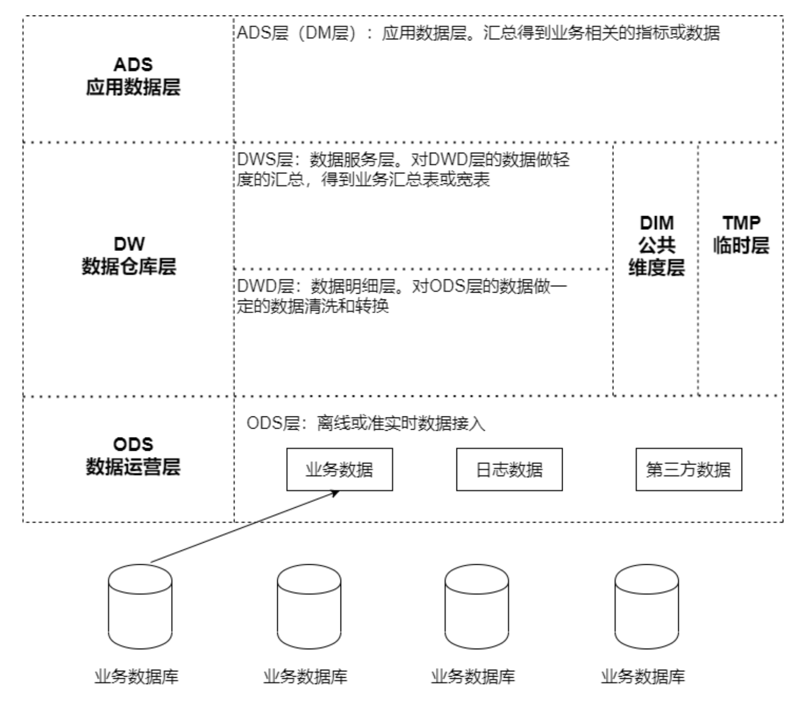
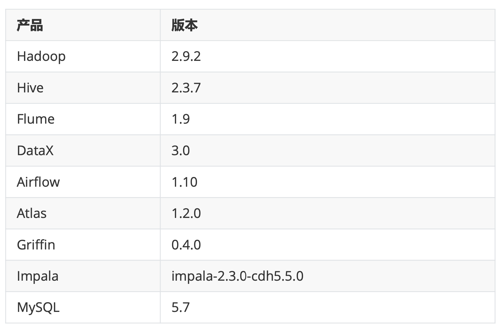
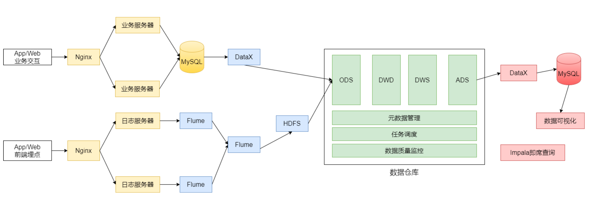

# 电商行业离线数仓项目
### 离线数仓架构

**ODS(数据准备区)**:数据仓库源头系统的数据表通常会**原封不动的存储一份**，这称为ODS层，也称为准备区。它们是后续数据仓库层加工数据 的来源。ODS层数据的主要来源包括:

* 业务数据库:可使用DataX、Sqoop等工具来抽取，每天定时抽取一次;在实时应用中，可用Canal监听MySQL的 Binlog，实时接入变更的数据; 
* 埋点日志: 线上系统会打入各种日志，这些日志一般以文件的形式保存，可以用 Flume 定时抽取;

**DW(数据仓库层)**:包含DWD、DWS、DIM层，由ODS层数据加工而成。主要完成数据加工与整合，建立一致性的维度，构建可复用的面向分析和统计的明细事实表，以及汇总公共粒度的指标。

* DWD(Data Warehouse Detail 细节数据层)，是业务层与数据仓库的隔离层。以业务过程作为建模驱动，基于每个具体的业务过程特点，构建细粒度的明细层事实表。可以结合企业的数据使用特点，将明细事实表的某些重要维度属性字段做适当冗余，也即宽表化处理;
* DWS(Data Warehouse Service 服务数据层)，基于DWD的基础数据，整合汇总成分析某一个主题域的服务数据。以分析的主题为建模驱动，基于上层的应用和产品的指标需求，构建公共粒度的汇总指标事实表; 公共维度层(DIM):基于维度建模理念思想，建立一致性维度;
* TMP层 :临时层，存放计算过程中临时产生的数据;

**ADS(应用数据层)**:基于DW数据，整合汇总成主题域的服务数据，用于提供后续的业务查询等。

### 技术选型

* **数据采集**:DataX、Flume
* **数据存储**:HDFS
* **数据计算**:Hive、MapReduce、Spark
* **调度系统**:Airflow 
* **元数据管理**:Atlas
* **数据质量管理**:Griffin 
* **即席查询**:Impala 
* **其他**:MySQL

### 系统逻辑架构

### 实现的功能

主要分析以下数据:
**日志数据**:启动日志、点击日志(广告点击日志)
**业务数据库的交易数据**:用户下单、提交订单、支付、退款等核心交易数据的分析

**数据仓库项目分析任务:**

* 会员活跃度分析主题
  * 每日新增会员数;每日、周、月活跃会员数;留存会员数、留存会员率
* 广告业务分析主题
  * 广告点击次数、广告点击购买率、广告曝光次数
* 核心交易分析主题
  * 订单数、成交商品数、支付金额

